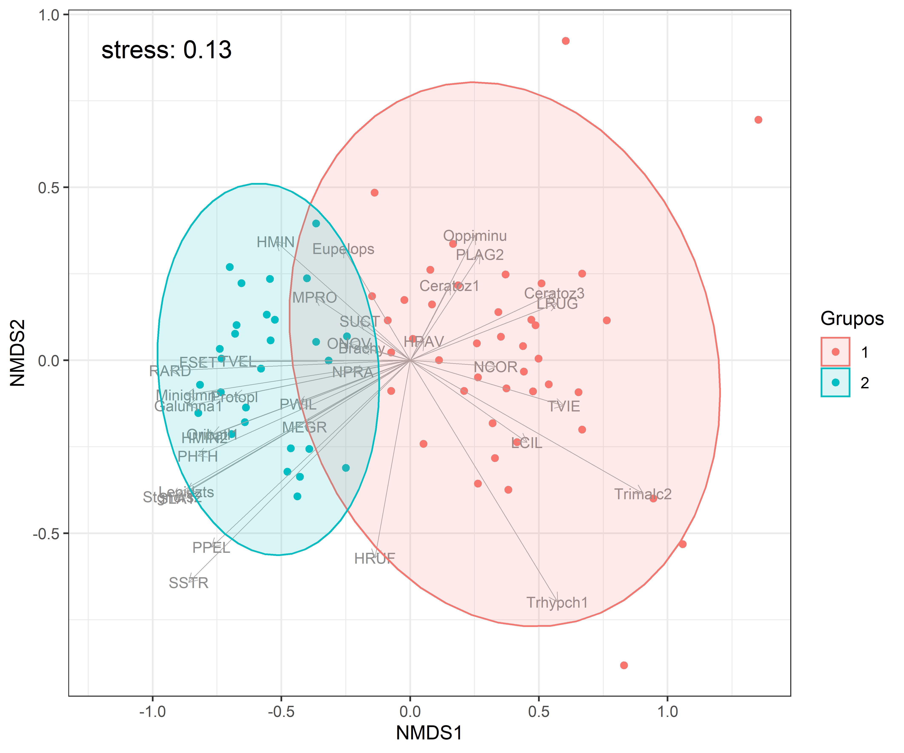

class: title-slide

<br>
<br>
# <span style = 'font-size: 100%;color:#5f00db;'>Análisis Multivariados en R</span>
## <span style = 'font-size: 90%;color:#212121;'>Curso Colaborativo IIAP - UNAMAD</span>
### <span style = 'font-size: 85%;color:#212121;'>Irwing S. Saldaña</span>
### <span style = 'font-size: 80%;color:#212121;'><br>[Instituto de Ciencias Antonio Brack](https://www.brackinstitute.com/)<br>Departamento de Ecoinformática y Biogeografía<br>Perú, 2021</span>

```{r setup, include = FALSE}
library(knitr)
library(tidyverse)
# Opciones por defecto
options(htmltools.dir.version = FALSE)
opts_chunk$set(fig.width = 7.252, fig.height = 4, dpi = 600,
               fig.retina=4, warning = FALSE, message = FALSE, cache=TRUE)
# Xaringan settings
xaringanExtra::use_tile_view() 
xaringanExtra::use_fit_screen() # xaringan-fit-screen
xaringanExtra::use_clipboard() #clipboard
xaringanExtra::use_editable(expires = 1) #Editable
xaringanExtra::use_scribble() #pencile with s
xaringanExtra::use_extra_styles(hover_code_line = TRUE, mute_unhighlighted_code = FALSE)

library(xaringanthemer)
style_mono_accent(base_color = "#5f00db",
                  title_slide_background_color="white",
                  code_highlight_color="#8ae8ff",
                  link_color="#71e3ff")
```

```{css, echo=FALSE}
/* Footnote */
.remark-slide-content:after {
    content: "Blgo. Irwing S. Saldaña | Instituto de Ciencias Antonio Brack, Perú";
    opacity: 0.9;
    position: absolute;
    text-align: left;
    height: 20px;
    font-size: 12pt;
    left: 120px;
    bottom: 18px;
    font-family: 'Yanone Kaffeesatz';
    font-weight: normal;
    width: 1200px;
}
```

---
class: inverse, middle, center 
background-image: url(figs/fondo.jpg)
background-size: cover
background-position: top

```{r, fig.align='center', out.width="25%", echo=FALSE}
include_graphics("figs/aboutme.png")
```

### Blgo. Irwing S. Saldaña <br><span style= 'font-size:80%; font-weigth: light;'> Instructor</span>
<span style= 'font-family: calibri; color: white'>,<br>
Instituto de Ciencias Antonio Brack, Perú</span>

.white[[Website](https://www.brackinstitute.com/)|[ResearchGate](https://www.researchgate.net/profile/Irwing-Saldana)|[Linkedin](https://www.linkedin.com/in/irssald/)|[R Latam Blog](https://rlatam.blog/) ]

---
class: inverse, middle, center , animated, slideInRight

# Necesidad de representar el mundo <br>en N-dimensiones
[ Paradoja de Simpson ]

---

# Paradoja de Simpson

Para comprender la importancia de los análisis multivariados comencemos revisando esta base de datos.

```{r, eval=FALSE}
library(tidyverse)
library(palmerpenguins)
pinguinos<-na.omit(penguins)
```

```{r, echo=FALSE}
library(tidyverse)
library(palmerpenguins)
library(gt)
pinguinos<-na.omit(palmerpenguins::penguins)
pinguinos %>% head() %>% 
  gt() 
```

---
# Paradoja de Simpson

```{r, eval=FALSE}
# Gráfico con ggplot2
library(tidyverse)
pinguinos %>%
  ggplot(aes(x=bill_length_mm, 
             y=bill_depth_mm)) +
  geom_point() + 
  labs(x="Longitud Pico (mm)", 
       y="Profundidad Pico (mm)",
       title="Longitud de pico en función de su profundidad") +
  theme_bw()
```

---
# Paradoja de Simpson

```{r, echo=FALSE, out.width="70%", fig.align='center'}
# Gráfico con ggplot2
library(tidyverse)
pinguinos %>%
  ggplot(aes(x=bill_length_mm, 
             y=bill_depth_mm)) +
  geom_point() + 
  labs(x="Longitud Pico (mm)", 
       y="Profundidad Pico (mm)",
       title="Longitud de pico en función de su profundidad") +
  theme_bw()
```

---
# Paradoja de Simpson

```{r, eval=FALSE}
# Gráfico con ggplot2
library(tidyverse)
pinguinos %>%
  ggplot(aes(x=bill_length_mm, 
             y=bill_depth_mm)) +
  geom_point() + 
  geom_smooth(method="lm")+ #<<
  labs(x="Longitud Pico (mm)", 
       y="Profundidad Pico (mm)",
       title="Longitud de pico en función de su profundidad") +
  theme_bw()
```

---
# Paradoja de Simpson

```{r, echo=FALSE, out.width="70%", fig.align='center'}
# Gráfico con ggplot2
library(tidyverse)
pinguinos %>%
  ggplot(aes(x=bill_length_mm, 
             y=bill_depth_mm)) +
  geom_point() + 
  geom_smooth(method="lm")+
  labs(x="Longitud Pico (mm)", 
       y="Profundidad Pico (mm)",
       title="Longitud de pico en función de su profundidad") +
  theme_bw()
```

---
# Paradoja de Simpson

```{r, eval=FALSE}
# Gráfico con ggplot2
library(tidyverse)
pinguinos %>%
  ggplot(aes(x=bill_length_mm, 
             y=bill_depth_mm,
             `color=species`,
             `fill=species`)) +
  geom_point() + 
  geom_smooth(method="lm")+ 
  labs(x="Longitud Pico (mm)", 
       y="Profundidad Pico (mm)",
       title="Longitud de pico en función de su profundidad") +
  theme_bw()
```

---
# Paradoja de Simpson

```{r, echo=FALSE, out.width="70%", fig.align='center'}
# Gráfico con ggplot2
library(tidyverse)
pinguinos %>%
  ggplot(aes(x=bill_length_mm, 
             y=bill_depth_mm,
             color=species,
             fill=species)) +
  geom_point() + 
  geom_smooth(method="lm")+
  labs(x="Longitud Pico (mm)", 
       y="Profundidad Pico (mm)",
       title="Longitud de pico en función de su profundidad y la variable especie") +
  theme_bw()
```

---
class: inverse, middle, center , animated, slideInRight

# Introducción a la Estadística Multivariada
[ Ordenamientos - Agrupamientos ]

---

# El Mundo es Multivariado

--

- Implica técnicas que involucran tres o más variables a la vez.

--

- Típicamente no se incluyen como _análisis multivariados_ del tipo regresión múltiple, MANOVA.

--

```{r, echo=F}
tibble(`Métodos interdependientes` = c("Conocido como ordenamiento sin restricciones","1 grupo de variables","Permiten describir","No buscan definir la relación entre variables dependientes o independientes", "Busca observar patrones de agrupamiento en los datos","No hay contraste de hipótesis.","Veremos: Clustering, CA, PCA, MDS, NMDS"), `Métodos dependientes` = c("Conocido como ordenamiento con restricciones (Canónico)", "2 grupos de variables : X e", "Permiten predecir", "Buscan definir la relación entre variables dependientes o independientes", "Busca definir la causa de los patrones de agrupamiento","Hay contraste de hipótesis","Veremos: RDA, CCA")) %>% 
  gt() 
```
---

# Bases de datos en Análisis Multivariados

```{r, echo=FALSE}
dataset1 <- openxlsx::read.xlsx("bases/tabla_multivariada.xlsx")
dataset1 %>% 
  head(8) %>% 
  gt() 
```

---
# ¿Qué es ordenamiento?

- Los métodos de ordenamientos "ordenan" las observaciones "filas" (que pueden representar individuos, sitios, parcelas, etc.), usando la información de múltiples variables "columnas".

- Se utilizan técnicas matemáticas de reducción de dimensiones para lograr proyectar toda (o la mayor parte) la información de una base de datos en tan solo 2 dimensiones (gráficos en plano cartesiano).

.pull-left[
```{r, fig.align='center', out.width="50%", echo=FALSE}

```
]

.pull-right[
```{r, fig.align='center', out.width="70%", echo=FALSE}

```
]

---
class: inverse, middle, center , animated, slideInRight

# Buscando relaciones entre variables
[ Variables y la manera de investigar sus relaciones ]

---

# Variables

- **Categóricas (Factores):**
  - *Binarias* (0,1; presencia-ausencia)
  - *Ordinal* (Alto > Medio > Bajo, mes de muestreo,)
  - *Nominal* (Sitio A, Sitio B, Sitio C)
  
- **Numéricas:**
  - *Discretas* (Abundancias-Conteos: 1,2,3,4,5)
  - *Continuas* (Mediciones: 1.96, 4.56, 3.75)
      - *Ratio* (Cero es absoluto, no negativos. Biomasa, concentraciones, longitudes, pesos)
      - *Intervalo* (Cero no es absoluto. Variables asociadas al tiempo)
      - *Porcentajes* (son especiales, restringidas al rango 0-1)

---

# Análisis Exploratorio Básico

También conocido como exploratory data analysis (EDA). Permite:
- Encontrar patrones en los datos.
- Sugerir estrategias de modelamiento.
- Corregir algún error en la base de datos.

1. **Univariado** 
  - Gráficos de barras.
  - Gráfico de densidad.
  - Histograma de frecuencias.
  - Cuantiles o  gráfico de boxplot.
  
2. **Bivariado** 

  - Variables .red[numérica vs numérica]: dispersión de puntos, densidad 2D.
  - Variables .red[numérica vs categórica]: boxplot.
  - Variables .red[categórica vs categórica]: gráfico de barras.

---

# Análisis Exploratorio Básico

```{r, eval=FALSE}
# Carga el archivo "variables ambientales.xlsx"
ambiente <- openxlsx::read.xlsx(file.choose())

# Activa la librería GGally
library(GGally)

# Gráfico
ggpairs(ambiente,
        upper= list(continuous= wrap("cor", method="spearman",
                                     color="#5f00db", size=3.5)),
        lower= list(continuous= wrap("points", 
                                       color="#5f00db", alpha=0.5)),
        diag= list(continuous= wrap("densityDiag", 
                                      fill="#5f00db", alpha=0.5)))+
  theme_test()
```

---

# Análisis Exploratorio Básico

```{r, fig.align='center', out.width="80%", echo=FALSE}
include_graphics("figs/ggpairs.png")
```

]
]

---
# Libro R for Data Science (Wickham & Grolemund, 2017)

[Visita aquí el libro Web, capítulo: Análisis Exploratorio de Datos](https://es.r4ds.hadley.nz/an%C3%A1lisis-exploratorio-de-datos-eda.html)

---

Greenacre & Primicerio (2014) propusieron la división de los Análisis Multivariados aplicados a las ciencias ecológicas en:  

--

- **Métodos Estructurales:** buscan la estructura de la base de datos.
- **Métodos Funcionales:** buscan explicar y. 
- **Métodos Híbridos:** mezclan características de los  anteriores.

```{r, fig.align='center', out.width="80%", echo=FALSE}

```

---

La estructura de las matrices de datos está relacionada con el tipo de análisis que se desea realizar 
```{r, fig.align='center', out.width="80%", echo=FALSE, fig.cap="<span style = 'font-size: 70%; color: #59c2ff;'>Greenacre, M., & Primicerio, R. (2014). Multivariate analysis of ecological data. Fundacion BBVA.</span>"}

```

---
# Transformaciones

.pull-left[
1) Logaritmo `log()`
- Si $x \to 0$, entonces $\log(x) \to -\infty$
- Si $x = 0$, entonces $\log(x=1) = 0$
- Si $x \to \infty$, entonces $\log(x) \to \infty$
- Además: $\log(ab) = log(a)+log(b)$

2) Transformación de Box-Cox-Chord

$$
g\left(y\right)=\begin{cases}
\frac{y^{\lambda}-1}{\lambda} & \lambda\ne0\\
     \log y & \lambda=0
\end{cases}
$$

3) Raíz cuadrada `sqrt()`
]

.pull-right[
4) Transformación de Hellinger ( $y_{i+}$ es $j = 1, \dots, m$)

$$y_{ij}^{\prime} = \sqrt{\frac{y_{ij}}{y_{i+}}}$$
5) Transformación de Chi-cuadrado
$$\chi^2_{x,y} = \sqrt{\sum_{j=1}^{J} \frac1{C_{j}}(x_j-y_j)^2}$$

6) Estandarización (Centrado y Escalado) `scale()`
]

---

class: inverse, middle, center , animated, slideInRight

# Midiendo Distancias 
[ La base de los análisis multivariados es hacerlo bien ]

---

# Matrices de Biodiversidad

Antes de ver las matrices de distancias, veamos una matriz de biodiversidad (abundancias,  presencia-ausencia):

```{r, eval=FALSE}
library(vegan)
data("mite")
View(mite)
```

```{r, echo=FALSE}
library(vegan)
data("mite")
mite %>% 
  head() %>% 
  gt()

```

---
# Matrices de Distancias

Los métodos multivariados buscan generar agrupaciones o clasificaciones de las observaciones (filas), basándose en sus distancias.

```{r, eval=FALSE}
matriz <- vegan::vegdist(mite, method = "bray") 
```

```{r, echo=FALSE}
library(vegan)
data("mite")
mite%>%
  vegdist(method = "bray") %>% as.matrix() %>% as_tibble() %>% mutate(N=1:nrow(.)) -> temp1
fin <- length(temp1) -1
temp1 %>% round(3) %>%  select(N, 1:fin) %>% 
  head(6) %>% 
  gt()

```

---

# Funciones de distancias en R

```{r, eval=F}
# También se pueden calcular con la función base dist().
# El Método puede ser uno de los siguiente:
# "euclidean", "maximum", "manhattan", "canberra", "binary" or "minkowski".
dist(DF, method="Método")
```

```{r, eval=F}
library(vegan)

# El Método puede ser uno de los siguiente:
# "manhattan", "euclidean", "canberra", "clark", "bray", "kulczynski", "jaccard", 
# "gower", "altGower", "morisita", "horn", "mountford", "raup", "binomial", "chao",  
# "cao", "mahalanobis", "chisq" "chord".
vegdist(DF, method="Método")
```

---
# Distancias Euclideanas

.pull-left[
Basado en el teorema de Pitágoras
$$ A^{2} = B^{2} + C^{2}$$

Lo que para efectos de la imagen, la distancia entre las observaciones $s_{j}$ y $s_{i}$, basada en las variables $X$ e $Y$ es:

$$d_{s_{j},s_{i}} = (X_j-X_i)^{2} + (Y_j-Y_i)^{2}$$

$$d_{s_{j},s_{i}} = \sqrt{(X_j-X_i)^{2} + (Y_j   -Y_i)^{2}}$$

Para un espacio N-dimensional de `N` variables:

$$d_{s_{j},s_{i}} = \sqrt{\sum_{n=1}^{N}(X_{jn}-X_{in})^{2}}$$
]

.pull-right[
```{r,echo=FALSE,  fig.align='center', out.width="100%"}

```

En un espacio N-dimensional $d_{s_{j},s_{i}}$ es la distancia Euclideana.
]

---

Si consideramos las filas 20 y 21 de la tabla presentada inicialmente, tendremos:

```{r, echo=FALSE}
dataset1 <- openxlsx::read.xlsx("bases/tabla_multivariada.xlsx")
dataset1 %>%
  slice(20:21) %>% 
  gt() 
```

La distancia Euclideana, considerando tres variables: Profundidad, Polución, y Temperatura,
$$\begin{equation} 
\begin{split}
d_{s_{j},s_{i}} & = \sqrt{\sum_{n=1}^{N}(X_{jn}-X_{in})^{2}}\\
d_{s_{20},s_{21}} & = \sqrt{(73-59)^{2}+(5.9-4.3)^{2}+(3.0-3.4)^{2}}\\
d_{s_{20},s_{21}} & = \sqrt{196+2.56+0.16}\\
d_{s_{20},s_{21}} & = \sqrt{198.72}\\
d_{s_{20},s_{21}} & = 14.09\\
\end{split}
\end{equation}$$

Este resultado representa el problema de que las variables tengan diferente escala de medición. **Solución:** transformar las variables de análisis.

---
class: middle, center 

```{r,echo=FALSE,  fig.align='center', out.width="80%"}
include_graphics("figs/Legendre Gallagher Transformations.jpg")
```

.center[[Legendre, P., & Gallagher, E. D. (2001). Ecologically meaningful <br>transformations for ordination of species data. Oecologia, 129(2), 271-280.](https://www.researchgate.net/publication/225701662_Ecologically_meaningful_transformations_for_ordination_of_species_data)]

---
class: middle, center 

```{r,echo=FALSE,fig.align='center',out.width="100%"}

```

---
class: middle, center 

```{r,echo=FALSE,fig.align='center',out.width="80%"}

```

---
class: middle, center 

```{r,echo=FALSE,fig.align='center',out.width="70%"}

```

---
class: middle, center 

```{r,echo=FALSE,  fig.align='center', out.width="100%"}

```

---
# Medidas de distancias y transformaciones para: Var. ambientales

Si se desea aplicar un PCA:

1) **Distancia Euclideana, Manhattan, Minkowski.** 
  - Sobre matriz de datos continuos por naturaleza (mediciones de variables ambientales).
  - Es necesario estandarizar (centrar y escalar) las variables para evitar el error por la escala de medición de las variables.

---
# Medidas de distancias y transformaciones para: Abundancias-PCA

Si se desea aplicar PCA:

Implica trabajar en un espacio euclidiano con una matriz de datos de abundancias (conteos por naturaleza). Lógicamente, las matrices se deben transformar para evitar el problema de doble zeros:

2) **Distancia de Chord**
  - Equivale a aplicar a la matriz de abundancias la transformación de Chord y luego medir distancias euclideanas sobre ello.
  - Le da poco peso a las especies raras. Adecuado para PCA o RDA.

3) **Distancia de Hellinger**
  - Equivale a aplicar a la matriz de abundancias la transformación de Chord y luego medir distancias euclideanas sobre ello.
  - Le da poco peso, mucho menos que Chord, a las especies raras. Adecuado para PCA o RDA.
  
---
# Medidas de distancias y transformaciones para: Abundancias-CA

Si se desea aplicar CA:

Es el método típico a aplicar con matrices de biodiversidad (abundancias o presencia-ausencia)

4) **Distancia de Chi-cuadrado**
  - Equivale a aplicar a la matriz de abundancias la transformación de Chi-cuadrado y luego medir distancias euclideanas sobre ello.
  - Le da más peso a las especies raras. No tiene importancia en análisis multivariados interdependientes (PCA, CA), pero si cobra relevancia para multivariados dependientes (RDA, CCA).
  
  - Hacer un PCA con matriz de biodiversidad transformada con Chi-cuadrado equivale (pero no es idéntico) a hacer un CA sobre la matriz original de biodiversidad.

---
# Medidas de distancias y transformaciones para: Abundancias-MDS

Si se desea aplicar PCoA, también llamado MDS:


5) **Distancia de Bray-Curtis**
  - Es el método de distancias más clásico en ecología para matrices de biodiversidad.
  - Preserva la influencia de las abundancias en cada sitio.

---
# Medidas de distancias y transformaciones para: Binarios-NMDS

Estos métodos no son métricos, por lo que no pueden ser proyectados en un plano euclideano (No es posible PCA). No requiere transformación de las matrices de presencia-ausencia.


6) **Distancia de Sørensen-Dice**
 - El llamado Sørensen cualitativo. Es la versión de Bray-curtis para datos binarios.

$$J(A,B)=\frac{2 \times (A \cap B)}{(A \cup B)+(A \cap B)} = \frac{2 \times (A \cap B)}{|A|+|B|} $$

7) **Distancia de Jaccard**
  - Similar a Sørensen. Nació para comparar parcelas de flora con presencia-ausencia. No da tanto peso a las especies más comunes como Sørensen.
  
$$J(A,B)= \frac{A \cap B}{A \cup B} = \frac{A \cap B}{|A|+|B|-{A \cap B}}$$


---
class: middle, center 

```{r,echo=FALSE, out.width="100%", fig.align='center'}

```

.center[[Legendre, P., & De Cáceres, M. (2013). Beta diversity as the variance of <br>community data: dissimilarity coefficients and partitioning. Ecology letters, 16(8), 951-963.](http://adn.biol.umontreal.ca/~numericalecology/Reprints/Legendre_De_Caceres_ELE_2013_app.pdf)]

---
class: middle, center 

```{r,echo=FALSE, out.width="50%", fig.align='center'}

```
Figure 2 Principal component biplot relating properties P4–P14 (red arrows) to the dissimilarity coefficients.

---
.pull-left[
### Tipo I:
- **Euclidean, Manhattan, Modiffied mean character difference, Species Profile.** son inapropiados para matrices de diversidad (abundancias) no transformadas.

### Tipo II:
- Distancias de **Hellinger y Chord** son adecuadas para  matrices de diversidad (abundancias) transformadas con Hellinger y Chord respectivamente.

### Tipo III: 
- Distancias **Canberra, Whittaker, Divergence, Bray-Curtis, Kulczyinki**, son adecuadas para  matrices de diversidad (abundancias)...
]

.pull-right[
<br>
<br>
<br>
...Si hay valores muy altos entre las abundancias, es mejor logaritmizarlas para evitar darle peso excesivo.

### Tipo IV: 
- Distancias **cuantitativas** basadas en abundancias: **Jaccard, Sørensen, Ochiai**.

### Tipo V: 
- Distancia de **Chi-cuadrado** es inapropiado para matrices de diversidad (abundancias) cuando hay presencia de especies raras, en caso se desee realizar un CCA (análisis de correspondencia canónica). Para CA, no influencia de manera importante esta propiedad.
]
---

# Espacio Euclideano

.pull-left[
1. **.orange[En el espacio euclidiano:]** 
 
 - Sistema de coordenadas cartesiano que respeta y satisface los axiomas de Euclides. 
 
 - La distancia entre dos puntos se mide mediante una generalización del teorema de Pitágoras.

1. **.orange[En el espacio no euclidiano:]** 

 - La distancia medidas en estos espacios se mide mediante geometría esférica, hiperbólica, entre otras. 
 
 - Estas distancias no son comparables con lo observado en un espacio euclideano.

]

.pull-rigth[
```{r, echo=F, out.width='40%', fig.align='center'}

```
]

---

# Espacio Euclideano y No Euclideano

--

```{r, echo=F, out.width='60%', fig.align='center'}

```

--

```{r, echo=F, out.width='60%', fig.align='center'}
knitr::include_graphics("http://www.37steps.com/wp-content/uploads/2013/01/metric-euclidean.png")
```

<span, style= 'font-size:70%; text-align: center; display:block;'>[Link Fig 1](http://www.drmarkliu.com/noneuclidean) |
[Link Fig 2](http://37steps.com/1617/non-euclidean-and-non-metric-dissimilarities/)</span>

---

# Métrico y No Métrico

.pull-left[
Un concepto más general que "Euclideano y no Euclideano", es el concepto de distancias métricas y no. Las distancias Euclideanas son métricas.

Los axiomas matemático de los espacios métricos son ( $d_{ab}$ es la distancia de "a" a "b"):

- $d_{ab} = d_{ba}$ 

- $d_{ab} \ge 0$ y es solamente 0 si $a = b$ 

- $d_{ab} \le d_{ac} + d_{cb}$ (Triangle inequality)
]

.pull-right[
```{r, echo=F, out.width='100%', fig.align='center'}
knitr::include_graphics("figs/cuadrado.jpg")
```
]

---

# Desarrollemos las secciones: 
### 1) Métodos de Transformación
### 2) Métodos de Distancias

```{r, echo=FALSE}
countdown::countdown(minutes = 20, seconds = 00, left = 0, right = 0, padding = "50px", margin = "12%", font_size = "6em", warn_when=30L)
```

---
class: inverse, middle, center , animated, slideInRight

# Métodos de Ordenamiento sin Restricciones
[ Clustering, CA, PCA, MDS, NMDS ]

---

.pull-left[

# Agrupamiento Jerárquico (Hierarchical Clustering)

- Una aplicación de las matrices de distancias es crear árboles de agrupamientos.

- Este no es un método estadístico (no hay contraste de hipótesis).

- Es una herramienta o técnica para identificar grupos o estructuras en los datos.
]

.pull-right[
<br>
<br> 
<br>
```{r, echo=F, out.width='140%', fig.retina=4}
knitr::include_graphics("figs/arbolini.png")
```
]

---

```{r, echo=F, out.width='100%', fig.retina=4}

```

---

background-image: url("figs/distmetodos.png")
background-size: cover

# Métodos de Aglomeración 

- Single linkage (a)

- Complete linkage (b)

- Average linkage o UPGMA (c)

- Método de Ward (Least Squares)

  [Link Figura](https://www.math-stat.unibe.ch/e237483/e237655/e243381/e281679/files281690/Chap11_ger.pdf)

---

# Desarrollemos la sección: 

### 3) Agrupamiento Jerárquico

```{r, echo=FALSE}
countdown::countdown(minutes = 60, seconds = 00, left = 0, right = 0, padding = "50px", margin = "12%", font_size = "6em", warn_when=30L)
```

---

# Análisis de Correspondencia (CA)

- Es una extensión del PCA adecuado para relacionar los casos de dos variables categóricas (matriz de contingencia).

- Genera una decomposición de eigenvectores igual que en el PCA proyectando el resultado en un plano
métrico euclidiano. 

- La diferencia es que la distancia generada es la distancia de Chi-Cuadrado en lugar de la Euclidiana.


---

# Desarrollemos la sección: 

### 4) Análisis de Correspondencia (CA)

```{r, echo=FALSE}
countdown::countdown(minutes = 25, seconds = 00, left = 0, right = 0, padding = "50px", margin = "12%", font_size = "6em", warn_when=30L)
```

---

# Análisis de Componentes Principales (PCA)

- El PCA es un método de reducción de dimensionalidad.
- Transforma un gran número de variables a un menor conjunto de variables no correlacionadas (ortogonales) llamadas Componentes Principales (PC).

.pull-left[
```{r, echo=F, out.width="70%", fig.align='center'}

```
]

.pull-right[

```{r, echo=F, out.width="100%", fig.align='center'}

```
]

---

# Análisis de Componentes Principales (PCA)

- El PCA es un método de reducción de dimensionalidad.
- Transforma un gran número de variables a un menor conjunto de variables no correlacionadas (ortogonales) llamadas Componentes Principales (PC).

.pull-left[
1. **.red[Estandarizar la base de datos]** <br>( $\mu=0$, $\sigma^2=1$).
1. Cálculo de las matrices de covarianzas.
1. Cálculo de los eigenvectores y eigenvalores.
1. Reordenamiento de los eigenvalores y eigenvectores
1. Reproyectar los datos en los ejes principales.
]

.pull-right[

```{r, echo=TRUE, eval=FALSE, fig.align='left'}
scale(datos)
```
]

---

# Análisis de Componentes Principales (PCA)

- El PCA es un método de reducción de dimensionalidad.
- Transforma un gran número de variables a un menor conjunto de variables no correlacionadas (ortogonales) llamadas Componentes Principales (PC).

.pull-left[
1. Estandarizar la base de datos <br>( $\mu=0$, $\sigma^2=1$).
1. **.red[Cálculo de las matrices de covarianzas.]**
1. Cálculo de los eigenvectores y eigenvalores.
1. Reordenamiento de los eigenvalores y eigenvectores
1. Reproyectar los datos en los ejes principales.
]

.pull-right[

```{r, echo=F, out.width="90%", fig.align='center'}

```
```{r, echo=F, out.width="90%", fig.align='center'}

```
]

---

# Análisis de Componentes Principales (PCA)

- El PCA es un método de reducción de dimensionalidad.
- Transforma un gran número de variables a un menor conjunto de variables no correlacionadas (ortogonales) llamadas Componentes Principales (PC).

.pull-left[
1. Estandarizar la base de datos <br>( $\mu=0$, $\sigma^2=1$).
1. Cálculo de las matrices de covarianzas.
1. **.red[Cálculo de los eigenvectores y eigenvalores.]**
1. Reordenamiento de los eigenvalores y eigenvectores
1. Reproyectar los datos en los ejes principales.
]

.pull-right[

```{r, eval=FALSE}
eigen(cov(scale(DF)))
```
.scroll-box-14[
```{r, echo=FALSE}
library(ade4)
library(tidyverse)
datos <-data("aravo")
amb <- aravo$env %>% as_tibble() %>% select(-ZoogD, -PhysD, -Form)
eigen(cov(scale(amb)))
```
]
]

---

# Análisis de Componentes Principales (PCA)

El PCA es un método de reducción de dimensionalidad que se utiliza a menudo para reducir la dimensionalidad de grandes conjuntos de datos, transformando un gran conjunto de variables en uno  
pequeño que aún contiene la mayor parte de la información del conjunto grande.

1. Estandarizar la base de datos ( $\mu=0$, $\sigma^2=1$).
1. Cálculo de las matrices de covarianzas.
1. Cálculo de los eigenvectores y eigenvalores.
1. **.red[Reordenamiento de los eigenvalores y eigenvectores]**
1. Reproyectar los datos en los ejes principales.

```{r, eval=FALSE}
pca
```

```{r, echo=FALSE}
library(ade4)
library(tidyverse)
datos <-data("aravo")
amb <- aravo$env %>% as_tibble() %>% select(-ZoogD, -PhysD, -Form)
prcomp(amb, scale.=TRUE)
```

---

# Desarrollemos la sección: 

### 5) Análisis de Componentes Principales (PCA)

```{r, echo=FALSE}
countdown::countdown(minutes = 60, seconds = 00, left = 0, right = 0, padding = "50px", margin = "12%", font_size = "6em", warn_when=30L)
```

---

# Análisis de Coordenadas Principales (MDS)

- Conocida como Escalamiento Multidimensional Métrico.

- PCA conserva  distancias euclidianas entre las muestras y CA las distancias chi-cuadrado, PCoA proporciona una representación euclidiana de un conjunto de objetos cuya relación se mide mediante cualquier método de distancias. 

- Tanto PCA y CA y PCoA devuelven un conjunto de ejes ortogonales.

## Eigenvalores negativos
En caso de utilizar un índice de distancia que no sea métrico, el PCoA puede producir ejes con valores propios negativos que no se pueden trazar. Soluciones:

  1. Convertir la distancia no métrica a métrica mediante transformación **.red[(BC + sqrt = métrica).]**
  2. Utilizar correcciones para evitar eigenvectores no negativos **.red[(e.g. lingoes).]**
  3. PCoA no proyecta las columnas de la tabla (especies), solo observaciones, pero podemos aplicar código para extraer esa información en R.
  
---

# Desarrollemos la sección: 

### 6) Análisis de Coordenadas Principales (PCoA, MDS)

```{r, echo=FALSE}
countdown::countdown(minutes = 60, seconds = 00, left = 0, right = 0, padding = "50px", margin = "12%", font_size = "6em", warn_when=30L)
```

---


# Escalamiento Multidimensional No Métrico (NMDS)

- Es muy útil cuando queremos **.red[representar en 2D las relaciones entre observaciones]**, siendo que obtuvimos un PCA o PCoA que nos indicaban que 3 a más dimensiones eran necesarias para capturar un gran porcentaje de la variabilidad (>50%).

- Es **.red[más robusto que el PCoA]** cuando se tiene que representar datos que no sean adecuados para un PCA (principalmente datos de conteos)

- Utiliza un algoritmo iterativo aleatorio, no paramétrico, para hallar con “prueba y error” la mejor posición para los puntos (la solución final). **.red[No se basa en descomposición de los eigenvalores como el PCA]**.

- No está restringido a un tipo de matriz de distancia, **.red[acepta cualquier matriz de distancia]**.

---

# Estrés del NMDS

.pull-left[

- Como regla general, el valor del estrés del NMDS deberá ser interpretado como

 - `≤0.05` = ideal

 - `<0.1` y `>0.05` = bueno

 - `>0.1` y `<0.2` = muy justo

 - `>0.2` y `<0.3` = sospechoso

 - `>0.3` = ordenamiento arbitrario.

]

.pull-right[

```{r, echo=F, out.width="100%", fig.align='center', fig.retina=4}

```
]

---

# Desarrollemos la sección: 

### 7) Escalamiento Multidimensional No Métrico (NMDS)

```{r, echo=FALSE}
countdown::countdown(minutes = 60, seconds = 00, left = 0, right = 0, padding = "50px", margin = "12%", font_size = "6em", warn_when=30L)
```


---
class: middle, center

.center[# Gracias por tu atención]