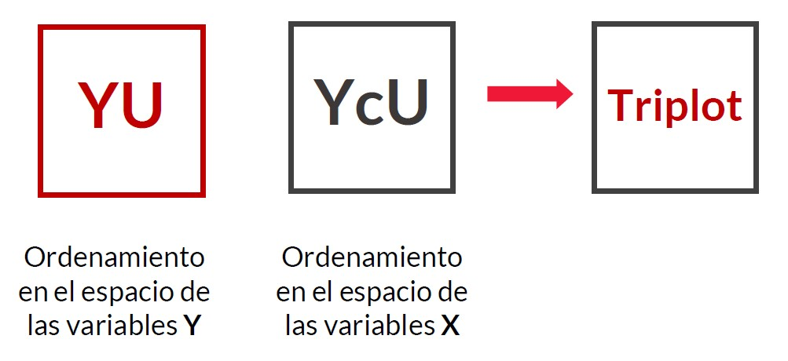

class: title-slide, middle, center

# <span style = 'font-size: 110%;color:#5f00db;'>Análisis Multivariados en R</span>
## <span style = 'font-size: 75%;color:#212121;'>Curso Colaborativo IIAP - UNAMAD</span>
### <span style = 'font-size: 85%;color:#212121;'>Irwing S. Saldaña</span>
### <span style = 'font-size: 80%; color:#919191; font-weight:lighter;'>[Instituto de Ciencias Antonio Brack](https://www.brackinstitute.com/)<br>Departamento de Ecoinformática y Biogeografía<br>Perú, 2021</span>

```{r setup, include = FALSE}
library(knitr)
library(tidyverse)
# Opciones por defecto
options(htmltools.dir.version = FALSE)
opts_chunk$set(fig.width = 7.252, fig.height = 4, dpi = 600,
               fig.retina=4, warning = FALSE, message = FALSE, 
               cache=TRUE)
# Xaringan settings
xaringanExtra::use_tile_view() 
xaringanExtra::use_fit_screen() # xaringan-fit-screen
xaringanExtra::use_clipboard() #clipboard
xaringanExtra::use_editable(expires = 1) #Editable
xaringanExtra::use_scribble() #pencile with s
xaringanExtra::use_extra_styles(hover_code_line = TRUE, mute_unhighlighted_code = FALSE)

library(xaringanthemer)
style_mono_accent(base_color = "#5f00db",
                  title_slide_background_color="white",
                  code_highlight_color="#8ae8ff",
                  link_color="#52d3f2",
                  colors = c(
                    red = "#f34213", 
                    purple = "#3e2f5b",
                    orange = "#ff8811",
                    green = "#136f63",
                    white = "#FFFFFF"))
```

```{css, echo=FALSE}
/* Footnote */
.remark-slide-content:after {
    content: "Blgo. Irwing S. Saldaña | Instituto de Ciencias Antonio Brack, Perú";
    opacity: 0.9;
    position: absolute;
    text-align: left;
    height: 26px;
    font-size: 12pt;
    left: 120px;
    bottom: 18px;
    font-weight: normal;
    width: 1200px;
}

.scroll-box-8 {
  height:8em;
  overflow-y: scroll;
}
.scroll-box-10 {
  height:10em;
  overflow-y: scroll;
}
.scroll-box-12 {
  height:12em;
  overflow-y: scroll;
}
.scroll-box-14 {
  height:14em;
  overflow-y: scroll;
}
.scroll-box-16 {
  height:16em;
  overflow-y: scroll;
}
.scroll-box-18 {
  height:18em;
  overflow-y: scroll;
}
.scroll-box-19 {
  height:19em;
  overflow-y: scroll;
}
.scroll-box-22 {
  height:22em;
  overflow-y: scroll;
}
.scroll-output {
  height: 80%;
  overflow-y: scroll;
}
```

---
class: inverse, middle, center 
background-image: url(figs/fondo.jpg)
background-size: cover
background-position: top

```{r, fig.align='center', out.width="25%", echo=FALSE}
include_graphics("figs/aboutme.png")
```

### Blgo. Irwing S. Saldaña <br><span style= 'font-size:80%; font-weigth: light;'> Instructor</span>
<span style= 'font-family: calibri; color: white'>Dpto. de Ecoinformática y Biogeografía,<br>
Instituto de Ciencias Antonio Brack, Perú</span>

.white[[Website](https://www.brackinstitute.com/)|[ ResearchGate ](https://www.researchgate.net/profile/Irwing-Saldana)|[ Linkedin ](https://www.linkedin.com/in/irssald/)|[ R Latam Blog ](https://rlatam.blog/)]|[ Github ](https://github.com/irwingss)

---
class: inverse, middle, center , animated, slideInRight

# Análisis Canónico

[ Análisis Multivariados con restricciones o constreñidos ]

---

# Análisis Canónico

```{r, fig.align='center', out.width="100%", echo=FALSE}

```

---

# Recordemos el Análisis de Correspondencia

Implica métodos en los que constreñimos o condicionamos una matriz de datos Y (normalmente de biodiversidad) con una matriz de datos X (normalmente de ambientales). Recordemos el análisis de correspondencia (CA):

```{r, eval=FALSE}
tm <- openxlsx::read.xlsx("bases/tabla_multivariada.xlsx")
tm
```

.scroll-box-14[
```{r, echo=FALSE}
especies <- read.csv("bases/cca_spe.csv", row.names=1, sep=";")
gt::gt(especies)
```
]

---

# Recordemos el Análisis de Correspondencia

Implica métodos en los que constreñimos o condicionamos una matriz de datos Y (normalmente de biodiversidad) con una matriz de datos X (normalmente de ambientales). Recordemos el análisis de correspondencia (CA):

```{r, eval=FALSE}
library(ca)
especies_log <- log1p(especies)
CA <-ca(especies_log)
summary(CA) #<<
```

.scroll-box-12[
```{r, echo=FALSE}
library(ca)
especies_log <- decostand(especies, "log")
CA <-ca(especies_log)
summary(CA) 
```
]

---
class: inverse, middle, center , animated, slideInRight

# Análisis de Correspondencia Canónica (CCA)

[ Incorporando una matriz X en el análisis de CA ]

---

# Análisis de Correspondencia Canónica (CCA)

--

El CCA es la versión constreñida del CA.

--

Se crea utilizando la función .purple[`cca()`]

--

Estructura del código en R:

```{r, eval=FALSE}
# Modo solo matrices 
CCA <- cca(matriz_X, matriz_Y)

# Modo fórmula (mucho más versátil)
CCA <- cca(matriz_Y ~ ., data= matriz_X)
```

--

 - Utiliza distancias de **Chi cuadrado.**
 - Recuerda que las _especies raras se ven sobreexpresadas_ (**logaritmizar** para reducir el peso de ellas).
 - Sirve para **identificar la proporción de varianza** de una matriz de biodiversidad (matriz de conteos) que es **explicada** por una matriz de datos ambientales (matriz de mediciones).

---

# Análisis de Correspondencia Canónica (CCA)

```{r, eval=FALSE}
ambiente <- read.csv("bases/cca_env.csv", row.names=1, sep=";")
CCA <- cca(especies_log ~ ., data = ambiente)
summary(CCA)
```

.scroll-box-18[
```{r, echo=FALSE}
ambiente <- read.csv("bases/cca_env.csv", row.names=1, sep=";")
CCA <- cca(especies_log ~ ., data = ambiente)
summary(CCA)
```
]

---

# Test de Permutaciones: modelo

-  Necesario para validar si la varianza explicada por la matriz ambiental explica más de lo que podría explicar por azar.

.scroll-box-18[
```{r}
# Probando la significancia del modelo CCA:
anova.cca(CCA) #<<
```
]

---

# Test de Permutaciones: términos

-  Necesario para validar si la varianza explicada por la matriz ambiental explica más de lo que podría explicar por azar.

.scroll-box-18[
```{r}
# Probando la significancia de los término (variables ambientales):
anova.cca(CCA, by="terms") #<<
```
]

---

# Test de Permutaciones: ejes canónicos

-  Necesario para validar si la varianza explicada por la matriz ambiental explica más de lo que podría explicar por azar.

.scroll-box-18[
```{r}
# Probando la significancia de los ejes CCA (CCA1 y CCA2 al menos deben ser significativos):
anova.cca(CCA, by="axis") #<<
```
]

---

# Gráfico Final CCA

```{r, eval=FALSE}
library(ggvegan)
autoplot(CCA)
```
```{r, fig.align='center', echo=FALSE, out.width="75%"}
# Gráfico con Autoplot de ggvegan
library(ggvegan)
autoplot(CCA, geom="text")+
  theme_bw()+
  geom_hline(yintercept = 0, color='gray60', lty=2)+
  geom_vline(xintercept = 0,color='gray60', lty=2)+
  scale_color_manual(values = c("#ff0037", "#0062eb"))+
  theme(legend.position = "none", aspect.ratio=2.5/7)

```

---
class: inverse, middle, center , animated, slideInRight

# Análisis de Redundancia (RDA)

[ La extensión canónica del PCA ]

---

# Análisis de Redundancia (RDA)

--

El RDA es la versión constreñida del PCA.

--

Se crea utilizando la función .purple[`rda()`]

--

Estructura del código en R:

```{r, eval=FALSE}
# Modo solo matrices 
RCA <- rca(matriz_X, matriz_Y)

# Modo fórmula (mucho más versátil)
RCA <- rca(matriz_Y ~ ., data= matriz_X)
```

--

 - Utiliza distancias **Euclideanas.** Pero se puede utilizar la misma propiedad de las distancias de Hellinger o distancias Chord que en el PCA.
 - Igual que el CCA sirve para **identificar la proporción de varianza** de una matriz de dependiente (matriz de conteos o "biodiversidad" pero transformada, o una matriz de mediciones) que es **explicada** por una matriz de datos independientes (matriz de mediciones).


---

# Tipos de Análisis de Redundancia (RDA)

--

- **RDA clásico (con distancias euclideanas)**

  - Usa PCA como motor de análisis multivariado
  - Trabaja con regresiones múltiples también

--

- **RDA basado en transformaciones (tb-RDA)**

  - Usa PCA como motor de análisis multivariado
  - Trabaja con regresiones múltiples también
  
--

- **RDA basado en distancias (db-RDA)**

  - Usa PCoA (MDS) como motor de análisis multivariado
  - Trabaja con regresiones múltiples también
  - Se requiere evitar eigenvalores negativos (aplicar raiz cuadrada a las distancias Bray Curtis para este fin)
--

.right[#### .red[...Veamos la estrategia de proyección del RDA]]

---
class: middle


```{r, fig.align='center', out.width="70%", echo=FALSE}

```

--

```{r, fig.align='center', out.width="70%", echo=FALSE}

```


---
class: middle

--

```{r, fig.align='center', out.width="70%", echo=FALSE}

```

--

```{r, fig.align='center', out.width="70%", echo=FALSE}

```


---
class: middle

--

```{r, fig.align='center', out.width="70%", echo=FALSE}

```

---

# Recomendaciones

-  Piensa en el RDA como si fueras a realizar un PCA.

- Cumple con los requerimientos del PCA, transforma las matrices si se requiere, o estandariza si es necesario.

```{r, eval=FALSE}
# Si se requiere escalar o no, se activa o desactiva este argumento
rda(..., scale=TRUE)
```


- Si la matriz dependiente es de abundancias: aplica tb-RDA o db-RDA

```{r, eval=FALSE}
# RDA basado en transformaciones
rda(..., scale=FALSE)

# RDA basado en distancias
dbrda(..., distance = "bray")
```

---

# Escalas

-   `scaling = 1` $\implies$ Se centra en sitios (filas), escala los scores de los sitios por $\lambda_i$
-   `scaling = 2` $\implies$ Se centra en especies (columnas Y), escala los scores de las especies por $\lambda_i$
-   `scaling = 3` $\implies$ Escalado simétrico, escala ambos scores por $\sqrt{\lambda_i}$
-   `scaling = 0` $\implies$ scores crudos

```{r scaling-example, results = "hide", eval=FALSE}
# Observar scores individuales
scores(RDA, choices = 1:2, display = "species", scaling = 3)
```

-   `scaling = 1` $\implies$ "sites"
-   `scaling = 2` $\implies$ "species"
-   `scaling = 3` $\implies$ "symmetric"
-   `scaling = 0` $\implies$ "none"

---
class: inverse, middle, center , animated, slideInRight

# Modelamiento de RDA 

[ También aplicado al CCA ]

---

# Modelamiento con RDA - CCA

Dado que estos métodos utilizan regresiones lineales en segundo plano para poder hacer el ajuste del modelo, las mismas recomendaciones que para un LM se deben aplicar aquí.

- Identificar las variables importantes y solo incluirlas a ellas.

- Si se conoce que la relación entre una variable y las especies tiene **comportamiento cuadrático o cúbico**, se puede incluir ello en la fórmula del modelo RDA.

- Si se sabe que **dos variables interactúan** y que dicha interacción influencia a la presencia de especies, también se puede incluir ello en la fórmula del modelo RDA.

- Procedimientos de **selección automática de variables** deben ser consideradas con cuidado.

---

```{r}
library(vegan)
data("varespec")
data("varechem")
RDA_vare <- rda(decostand(varespec, "hellinger") ~ Al + K + Baresoil, data = varechem) #<<
RDA_vare
```

---

```{r}
library(vegan)
data("varespec")
data("varechem")
RDA_vare <- rda(decostand(varespec, "hellinger") ~ Al + P + K + Baresoil, data = varechem) #<<
RDA_vare
```

---

```{r}
library(vegan)
data("varespec")
data("varechem")
RDA_vare <- rda(decostand(varespec, "hellinger") ~ Al + P*(K + Baresoil), data = varechem) #<<
RDA_vare
```

---

# Enfoques automáticos <br>de selección de modelos

- Define el mejor modelo con todas las posibles variables importantes (Modelo Full)

- Utiliza el método de selección corregido para RDA-CCA (usando $R^2$ Ajustado)

```{r, eval=FALSE}
# Revisar r cuadrado ajustado pero solo de un modelo
RsquareAdj(Modelo_Full)

# Selección paso a paso ajustada por r cuadrado ajustado
ordiR2step(Modelo_Nulo, Modelo_Full, trace=FALSE)
```

---

```{r}
permustats(anova(RDA_vare)) |> summary()
```

---

```{r, out.width="90%"}
permustats(anova(RDA_vare)) |> densityplot()
```

---

```{r}
permustats(anova(RDA_vare, by="axis")) |> summary()
```

---

```{r, out.width="90%"}
permustats(anova(RDA_vare, by="axis")) |> densityplot()
```

---
 
```{r}
permustats(anova(RDA_vare, by="terms")) |> summary()
```

---

```{r, out.width="90%"}
permustats(anova(RDA_vare, by="terms")) |> densityplot()
```
