class: title-slide, middle, center

# <span style = 'font-size: 110%;color:#5f00db;'>Análisis Estadístico Lineal Avanzado en R</span>
## <span style = 'font-size: 75%;color:#212121;'>Curso Colaborativo IIAP - UNAMAD</span>
### <span style = 'font-size: 85%;color:#212121;'>Irwing S. Saldaña</span>
### <span style = 'font-size: 80%; color:#919191; font-weight:lighter;'>[Instituto de Ciencias Antonio Brack](https://www.brackinstitute.com/)<br>Departamento de Ecoinformática y Biogeografía<br>Perú, 2021</span>

```{r setup, include = FALSE}
library(knitr)
library(tidyverse)
# Opciones por defecto
options(htmltools.dir.version = FALSE)
opts_chunk$set(fig.width = 7.252, fig.height = 4, dpi = 600,
               fig.retina=4, warning = FALSE, message = FALSE, 
               cache=TRUE)
# Xaringan settings
xaringanExtra::use_tile_view() 
xaringanExtra::use_fit_screen() # xaringan-fit-screen
xaringanExtra::use_clipboard() #clipboard
xaringanExtra::use_editable(expires = 1) #Editable
xaringanExtra::use_scribble() #pencile with s
xaringanExtra::use_extra_styles(hover_code_line = TRUE, mute_unhighlighted_code = FALSE)

library(xaringanthemer)
style_mono_accent(base_color = "#5f00db",
                  title_slide_background_color="white",
                  code_highlight_color="#8ae8ff",
                  link_color="#52d3f2",
                  colors = c(
                    red = "#f34213", 
                    purple = "#3e2f5b",
                    orange = "#ff8811",
                    green = "#136f63",
                    white = "#FFFFFF"))
```

```{css, echo=FALSE}
/* Footnote */
.remark-slide-content:after {
    content: "Blgo. Irwing S. Saldaña | Instituto de Ciencias Antonio Brack, Perú";
    opacity: 0.9;
    position: absolute;
    text-align: left;
    height: 26px;
    font-size: 12pt;
    left: 120px;
    bottom: 18px;
    font-weight: normal;
    width: 1200px;
}

.scroll-box-8 {
  height:8em;
  overflow-y: scroll;
}
.scroll-box-10 {
  height:10em;
  overflow-y: scroll;
}
.scroll-box-12 {
  height:12em;
  overflow-y: scroll;
}
.scroll-box-14 {
  height:14em;
  overflow-y: scroll;
}
.scroll-box-16 {
  height:16em;
  overflow-y: scroll;
}
.scroll-box-18 {
  height:18em;
  overflow-y: scroll;
}
.scroll-box-19 {
  height:19em;
  overflow-y: scroll;
}
.scroll-box-22 {
  height:22em;
  overflow-y: scroll;
}
.scroll-output {
  height: 80%;
  overflow-y: scroll;
}
.pull-code {
    color: #777;
    width: 40%;
    height: 92%;
    float: left;
}
.pull-plot {
    width: 59%;
    float: right;
    padding-left: 1%;
}
.remark-inline-code {
    background: #e7e8e2;
    border-radius: 3px;
    padding: 4px;
}
.blockquote {
  border-left: solid 5px lightgray;
  padding-left: 1em;
}

```

---
class: inverse, middle, center 
background-image: url(figs/fondo.jpg)
background-size: cover
background-position: top

```{r, fig.align='center', out.width="25%", echo=FALSE}
include_graphics("figs/aboutme.png")
```

### Blgo. Irwing S. Saldaña <br><span style= 'font-size:80%; font-weigth: light;'> Instructor</span>
<span style= 'font-family: calibri; color: white'>Dpto. de Ecoinformática y Biogeografía,<br>
Instituto de Ciencias Antonio Brack, Perú</span>

.white[[Website](https://www.brackinstitute.com/)|[ ResearchGate ](https://www.researchgate.net/profile/Irwing-Saldana)|[ Linkedin ](https://www.linkedin.com/in/irssald/)|[ R Latam Blog ](https://rlatam.blog/)]|[ Github ](https://github.com/irwingss)

---
class: inverse, middle, right , animated, slideInRight
background-color: black
name: GLM

# .white[George Box]
.white[ "...en esencia , todos los modelos están equivocados, pero algunos son útiles." ]

---
class: inverse, middle, right , animated, slideInRight
background-color: black
name: GLM

# .white[ Principio de Parsimonia ]
.white[ "En igualdad de condiciones, la explicación más sencilla suele ser la correcta" ]

---
class: inverse, middle, center , animated, slideInRight
name: GLM

# Introducción a los<br>Modelos Lineales de Efectos Mixtos (LMM)
[ Ajustando temas de dependencia en los modelos lineales ]

---

# Homocedasticidad en los modelos lineales

Cuando hay **homocedasticidad**, la varianza de la variable respuesta (Y) es constante a lo largo de la población: no depende del valor de X. 

.pull-left[
```{r, echo=FALSE}
data(iris)
library(tidyverse)
library(ggfortify)
lm(Sepal.Length ~ Petal.Length, data=iris %>% 
    filter(Species=="versicolor")) %>%
  autoplot(which = 1,  colour = "purple",  label = FALSE,
           smooth.colour = "black", ad.colour = "gray60",
           nrow=1, ncol=1, size=3, alpha=0.5)+
  labs(title="Homocedasticidad")+
  theme_test()+
  theme(plot.title=element_text(hjust=0.5))
```
]

.pull-right[
```{r, echo=FALSE}
data(iris)
library(tidyverse)
library(ggfortify)
lm(Sepal.Length ~ Petal.Length, data=iris) %>%
  autoplot(which = 1,  colour = "purple",  label = FALSE,
           smooth.colour = "black", ad.colour = "gray60",
           nrow=1, ncol=1, size=3, alpha=0.5)+
  labs(title="Heterocedasticidad")+
  theme_test()+
  theme(plot.title=element_text(hjust=0.5))
```
]

Lo opuesto es **Hetercedasticidad**, y ocurre comunmente cuando la data no es independiente, evidenciando un efecto de .red[**agrupamiento**] en la colecta de la data.

---
class: center, middle

## Enfoques de análisis

--

```{r, echo=F, fig.align='center', out.width="90%"}
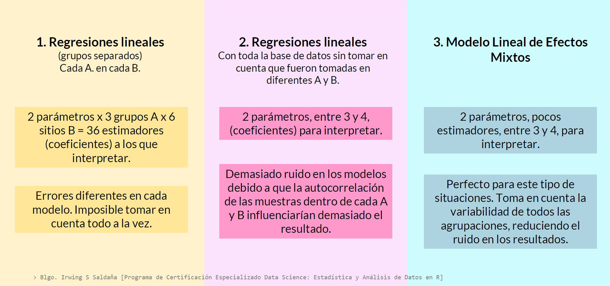
```

---

# Nomenclatura de Efectos Mixtos

Se llaman así debido a que involucran dos tipos de variables en el componente sistemático de las fórmulas:

#### Efectos fijos: 

- Es una variable categórica o numérica.
- Variables de las cuales estamos interesados en obtener conclusiones.
    - Si es categórica, realiza mediciones en todos los posibles niveles que esa variable pueda tener según mi estudio.
    - Si es un factor, estamos interesados en obtener información sobre todos los niveles ( e.g ., tratamientos) para los que se recopilaron los datos.

#### Efectos aleatorios: 
- Es una variable categórica (variables de agrupamiento).
- Variables de las cuales NO estamos interesados en obtener conclusiones, pero que generan variabilidad.

---

# Topología de modelos `lmer()` en R

#### Modelos clásicos de solo efectos fijos (LM): 
- En los modelos lineales clásicos $y = \beta_0 + \sum(\beta_ix_i)$ se considera a $\beta_0$ y $\beta_i$ como efectos fijos.
      
```{r, eval=FALSE}
# Ejemplo en R con dos variables explicativas (Efectos fijos)
lm(Var_respuesta ~ Efec_fijo + Efec_fijo, data=DF) #<<
```
 
#### Modelos con efectos mixtos (LMM):
- Son variables que generan variabilidad en la varianza del modelo por el efecto de procesos de agrupamiento, anidamiento o cruzamiento en la toma de datos.
      - En el modelo se incluyen como  $y = \beta_0 + \sum(\beta_ix_i) + Z_u$
      
```{r, eval=FALSE}
# Ejemplo en R con dos variables explicativas (Ambos tipos de efectos)
lm(Var_respuesta ~ Efec_fijo + (1|Efec_Aleatorio), data=DF) #<<
```

---
class: center, middle

## Modelos Lineales de Efectos Mixtos 

--
```{r, echo=F, fig.align='center', out.width="100%"}
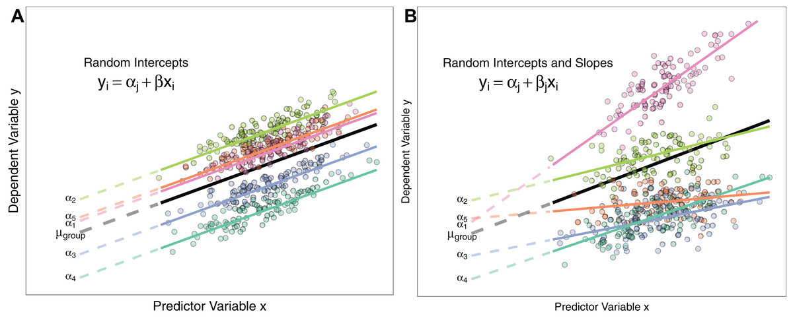
```
[Fuent: rinterceptyslope.jpg](https://peerj.com/articles/4794/)

---

.pull-code[

### Modelo LMM con Interceptos Aleatorios

```{r, eval=FALSE}
lmer(y ~ x + (1|v.aleatoria), data=DF)
```

- Se permite que el intercepto varíe para cada grupo.

- Se asume que la variable explicativa tiene la misma tendencia de efecto para cada grupo, pero el promedio esperado difiere según la observación pertenezca a uno u otro grupo. 

$$y=\beta_0 + v_0 + \beta_1x_1 + \epsilon$$

]

.pull-plot[
```{r, echo=F, fig.align='center', out.width="100%"}
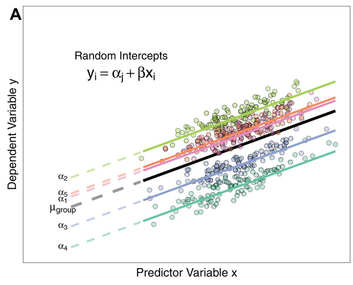
```
]

---

.pull-code[

### Modelo LMM con Interceptos y Pendientes Aleatorias

```{r, eval=FALSE}
lmer(y ~ x + (x|v.aleatoria), data=DF)
```

- Se usa cuando se conoce que la variable explicativa tiene efectos diferentes en los diferentes grupos evaluados.

- Esto genera que cada uno tenga una pendiente diferente.

$$y=\beta_0 + v_0 + (\beta_1 + v_1)x_1 + \epsilon$$

]

.pull-plot[
```{r, echo=F, fig.align='center', out.width="100%"}
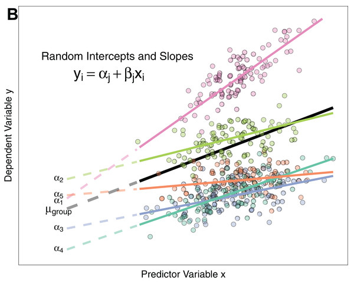
```
]

---

# Desarrollemos la práctica

```{r, echo=FALSE}
countdown::countdown(minutes = 60, seconds = 00, left = 0, right = 0, padding = "100px", margin = "12%", font_size = "6em", warn_when=30L)
```


---
class: inverse, middle, center , animated, slideInRight
name: GLM

# Introducción a los<br>Modelos Lineales Generalizados (GLM)
[ Expandiendo los límites de un modelo lineal ]

---

# Modelos Generalizados Lineales

Recordemos, en los modelos lineales **LM** asumimos que:

--
$$ Y|(X_1 = x_1,...,X_p = x_p) \sim N(\beta_0+\beta_1x_1+...+\beta_px_p, \sigma^2) $$
--
Por lo tanto
$$\mathbb{E}[Y|X_1 = x_1,...,X_p = x_p] = \beta_0+\beta_1x_1+...+\beta_px_p, \sigma^2=\eta.$$
- La condición necesaria para satisfacer que el error sea normal es que $Y$ sea continua.

--
<br>

**Los GLM buscan ampliar las limitantes de los LM para incorporar análisis variables respuesta principalmente discretas (binarias o conteos).**

---

# Definición Matemática de un GLM

Para definir un **GLM** necesitamos dos componentes 

--

- **Componente respuesta $Y$ (variable respuesta, dependiente):**
Las observaciones de y son independientes y provienen de una familia de dispersión exponencial (FDE)
$$Y|(X_1 = x_1,...,X_p = x_p) \sim FED(\mu, \phi)$$

<br>

--

- **Componente sistemático $\eta$ (variable(s) explicativa(s), independiente(s)):**
Es la parte de la ecuación definida por las variables explicativas, los coeficientes, la pendiente y el error. Sigue siendo un componente lineal.
$$\eta=\beta_0+\beta_1x_1+...+\beta_px_p + \epsilon$$

--

Por tanto, el modelo GLM se define como función de la variable y predicha $g(\mu)$
$$g(\mu)=\eta=\beta_0+\beta_1x_1+...+\beta_px_p + \epsilon$$

---

#Función de enlace
La función $g(\mu)$ es conocida como **función de enlace .orange[(link function)]**. Esta  es reversible, por lo que podemos transformar los coeficientes resultantes para calcular el promedio de calculado para $Y$ como $g^{-1}(\eta)=\mu$

```{r, echo=F}
tibble(Familia = c("Gausiana","Binomial","Poisson","Gamma","Inversa Gausiana","Quasibinomial","Quasipoisson","Binomial Negativa"),
`Función de enlace` = c("Identity","Logit, Probit, cloglog","Log, identity, sqrt","Inverse, identity, Log","Inverse, identity, Log","Logit, Probit, cloglog","Log, identity, sqrt","Log, identity, sqrt"),
`Función en R` = c("glm()","glm()","glm()","glm()","glm()" ,"glm()","glm()","glm.nb()"),
`Argumento family/link` = c("gaussian(link='identity')", "binomial(link='logit')","poisson(link='log')","Gamma(link='inverse')","inverse.gaussian(link = '1/mu^2')","quasibinomial(link = 'logit')","quasipoissonl(link = 'log')","link = 'log'"))%>%
  kbl(escape = FALSE) %>%
  kable_paper(bootstrap_options = "striped", full_width = T)%>%
  row_spec(0, bold = F, background= "#5f00db", color = "white") #
```

---

<br>
<br>
**.purple[Las fuciones canónicas] .orange[(definidas por defecto)]** de las familias de distribución de probabilidades se describen a continuación. Es importante también saber cuál es el valor y calculado en el Rango de cada función.
<br>

Distribución | Rango de $Y$ | Notación de<br>distribución | Función de <br>enlace canónica $g(\mu)$ | Valor esperado $\mathbb{E}(Y)$ | Param.<br>Varianza $\phi$  
-|-|    :----:   |    :----:   |    :----:   |    :----:   |
Gaussiana | $\mathbb{R}$ | $\mathcal{N}(\mu,\sigma^2)$ | $\mu$ | $\eta$ | $\sigma^2$
Bernoulli | ${0,1}$ | $\mathrm{Ber}(p)$ | $\mathrm{logit}(\mu)$ | $\mathrm{logistic}(\eta)$ | 1 
Binomial | ${0,...,N}$ | $\mathrm{B}(N,p)$ | $\log\left(\frac{\mu}{N-\mu}\right)$ | $N\cdot\mathrm{logistic}(\eta)$ | 1
Poisson | ${0,1,...}$ | $\mathrm{Pois}(\lambda)$ | $\log(\mu)$ | $e^\eta$ | 1
Gamma| $(0,\infty)$ | $\Gamma(a,\nu)$ | $-\frac{1}{\mu}$ | $-\frac{1}{\eta}$ | $\frac{1}{v}$

---

# Topología de los función `glm()` en R

```{r topologia glm, eval=F}
# Estructura generalizada
glm(formula, data = DF, family = `familia(link = "función.de.enlace"`))

# Regresión logística (ejemplo)
glm(y ~ x1 + x2, data = DF, family = binomial(link = "logit"))

# Regresión de Poisson (ejemplo)
glm(y ~ x1 + x2, data = DF, family = poisson(link = "log"))

```

<br>
- Las **.orange[fórmulas]** definen el enfrentamiento de las variables explicativas $X$ y la variable respuesta $Y$.

---

# Regresiones GLM

- **.orange[Regresión Logística (Bernoulli, Binomial)]**

- **.orange[Regresión de Poisson]**

- **.orange[ Regresión Binomial Negativa]**

- **.orange[Regresión de Hurdle]**

- Regresión Zeroinflado

- Regresión Beta

- Regresión Gaussiana ( $\equiv$ Regresión Lineal Clásica)

- Regresión Gamma

- ...

---
class: inverse, middle, center, animated, slideInRight1
# Regresión Logística
[ Modelamiento de respuestas discretas binarias ]

---
class: center, middle

--

## ¿Cómo luce una regresión logística?

--

```{r, echo=F, fig.align='center', out.width="55%"}
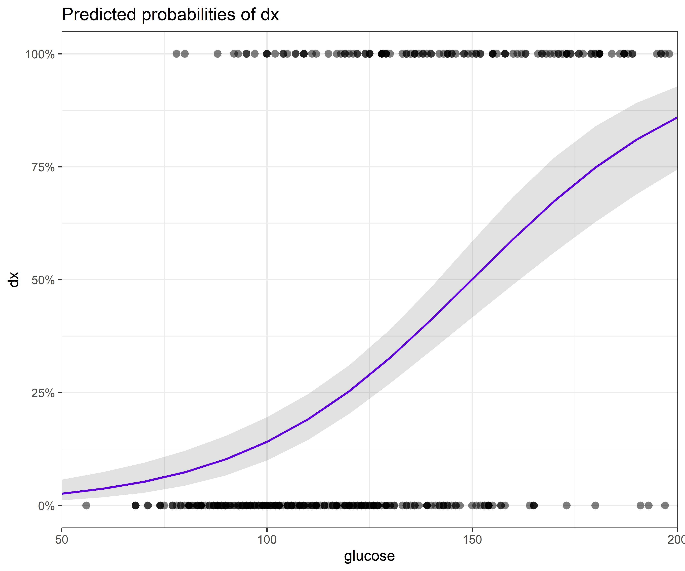
```

---

# Regresión Logistica

- La variable respuesta $Y$ es binaria (Distribución de Probabilidades de Bernoulli)


\begin{align*}
Y=\left\{\begin{array}{ll}
1,&\text{(evento) con probabilidad }p,\\
0,&\text{(no evento) con probabilidad }1-p,
\end{array}\right.
\end{align*}

--

- Si asumimos que 
$$\mathbb{E}[Y|X_1 = x_1,...,X_p = x_p] = \beta_0+\beta_1x_1+...+\beta_px_p, \sigma^2=\eta$$

<center>Estaríamos aceptando predicciones  negativas y positivas fuera del rango $[0,1]$. </center>

--

<br>
- Para evitar tal error, se utiliza una **.orange[función de enlace]** $\mathbb{g}()$ que **.purple[proyecte]** $Y$ sobre los números $\mathbb{R}$ $(-\infty, +\infty)$, y su operación inversa $\mathbb{g}^{-1}()$ para **.purple[devolver]** las predicciones del modelo al rango $[0,1]$.

---

# Concepto de Probabilidad

.pull-left[
- **Probabilidad:** es la probabilidad de que un evento suceda.
$$p=0.8$$ 

<center> <span style= 'color: #949494;'> Imagina que ese p significa un 80% de probabilidad de que llueva en un día nublado. </span> </center>

<br>
<br>
- Para **.orange[interpretar los resultados]** de la regresión logística, debemos introducir la terminología adecuada para ello: los **odds**. 
]

.pull-right[
```{r, fig.align='center', out.height=400, echo=FALSE}
knitr::include_graphics("https://source.unsplash.com/QxxqESp1ll8")
```
]

---

# Concepto de Odds


- **Odds:** es la **.orange[posibilidad de éxito]** de un evento. Está definido como la probabilidad de que el evento ocurra dividida por la probabilidad de que este mismo evento no ocurra.  

--

$$\begin{align}
\mathrm{odds}(Y):=\frac{p}{1-p}=\frac{\mathbb{P}[Y=1]}{\mathbb{P}[Y=0]}
\end{align}$$

--

<center> <span style= 'color: #949494;'> Si existe un 80% de probabilidad de que llueva en un día nublado y 20% de que no las posibilidades de que llueva en un día nublado son: </span> </center>

--

$$ odds= \frac{0.8}{1-0.8} = \frac{0.8}{0.2} = 4 $$

--

<center> <span style= 'color: #949494;'> La posibilidad de que llueva en un día nublado es 4 veces la posibilidad de que no llueva. </span> </center>

---

# Concepto de Odds ratio

- **Odds ratio:** es el **.orange[ratio o división de dos odds]** asociados. Está definido como la probabilidad de <br>que el evento ocurra dividida por la probabilidadde que este mismo evento no ocurra.  

--

$$ \text{odds ratio} = \frac{odds_1}{odds_2} = \frac{\frac{p_1}{1-p_1}}{\frac{p_2}{1-p_2}}  $$

--

<center> <span style= 'color: #949494;'> Si consideramos que la probabilidad de que llueva $p_2$ en un día soleado es de 10% </span> </center>

$$ odds_2 = \frac{p_2}{1-p_2} = \frac{0.1}{1-0.1} = \frac{0.1}{0.9} = 0.111...$$

--

<center> <span style= 'color: #949494;'> En consecuencia </span> </center>
$$ \text{odds ratio} = \frac{odds_1}{odds_2} = \frac{4}{0.111} = 36$$

--

<center> <span style= 'color: #949494;'>El ratio de las posibilidades de que llueva en un día nublado es 36 veces la posibilidad de llueva en un día soleado  </span> </center>

---

# Por qué Odds y Log odds

$$
\begin{align}
odds &= \frac{p}{1-p} \\
\mathbb{log}(odds) &= \mathbb{log}(\frac{p}{1-p}) 
\end{align}
$$
--

.pull-left[
$$
\begin{align}
\mathbb{log}(odds) &= \mathbb{log}(\frac{p}{1-p}) \\
\text{si p = 0, entonces} \\
\mathbb{log}(odds) &= \mathbb{log}(\frac{0}{1-0}) \\
\mathbb{log}(odds) &= \mathbb{log}(\frac{0}{1}) \\
\mathbb{log}(odds) &= \mathbb{log}(0) - \mathbb{log}(1)\\
\mathbb{log}(odds) &= -\infty - 0\\
\mathbb{log}(odds) &= -\infty
\end{align}
$$

]

.pull-right[
$$
\begin{align}
\mathbb{log}(odds) &= \mathbb{log}(\frac{p}{1-p}) \\
\text{si p = 1, entonces} \\
\mathbb{log}(odds) &= \mathbb{log}(\frac{1}{1-1}) \\
\mathbb{log}(odds) &= \mathbb{log}(\frac{1}{0}) \\
\mathbb{log}(odds) &= \mathbb{log}(1) - \mathbb{log}(0)\\
\mathbb{log}(odds) &= 0 - -\infty\\
\mathbb{log}(odds) &= +\infty
\end{align}
$$
]

---

.pull-code[

# Función Logit
- Proyecta valores entre `[0,1]` en los $\mathbb{R}$ 
$$\begin{align}
&\mathrm{logit}(\mathbb{E}[Y|X_1=x_1,\ldots,X_p=x_p])=\eta\\
\end{align}$$
- Siendo que, 
$$\begin{align*}
\eta=\beta_0+\beta_1x_1+\cdots+\beta_px_p.
\end{align*}$$

- Para ser más precisos en la interpretación de los coeficientes, necesitamos introducir las posibilidades **.orange[(los odds)]**.

]

.pull-plot[
```{r, fig.align='center', out.width="95%", echo=FALSE}
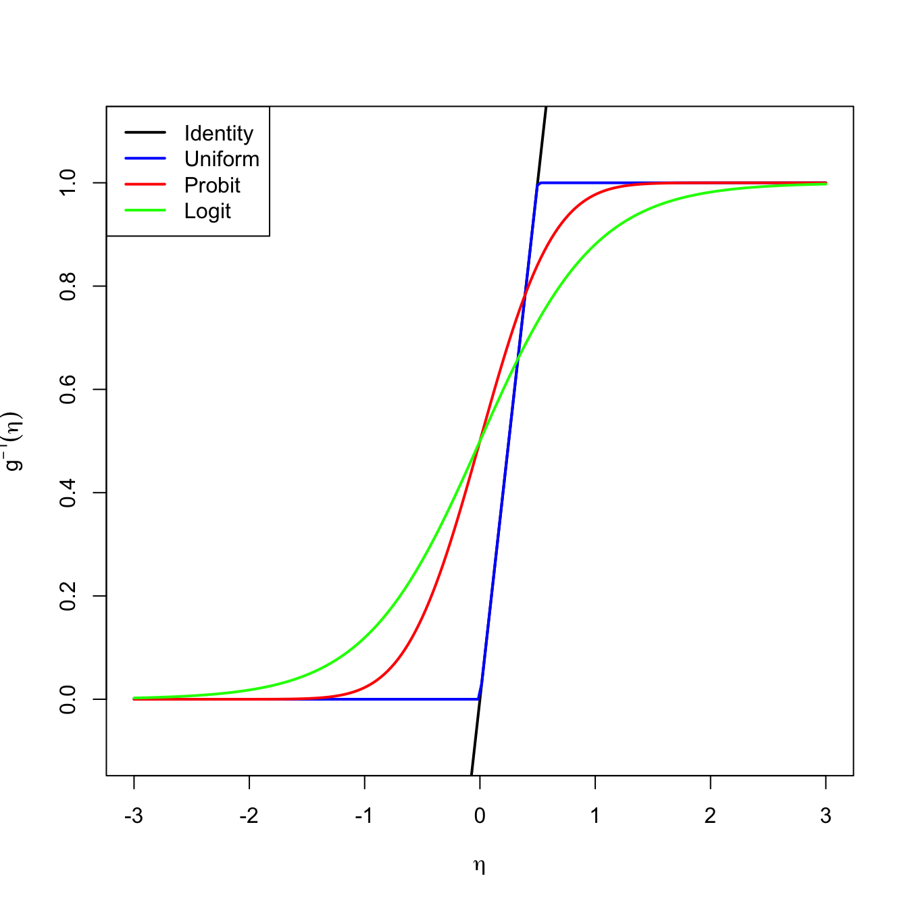
```
]

---

# Intepretar los coeficientes (R. logística)

- $\beta_0:$ son los log-odds cuando $X_1=\ldots=X_p=0$ 
- $\beta_j$ es el incremento de los log-odds por cada unidad de incremento de la variable $X_j$ cuando las demás variables explicativas se mantinenen constantes en cero (no cambian).

--
<br>

Como estos valores no son sencillos de interpretar, se deben **.orange[transformar]**:
- $e^{\beta_0}:$ son los odds cuando $X_1=\ldots=X_j=0$ 
- $e^{\beta_j}:$ es el incremento multiplicativo de los odds por cada unidad de incremento de la variable $X_j$ cuando las demás variables explicativas se mantinenen constantes en cero (no cambian).

--
<br>
<br>

Interpretar los resultados a primera vista nos puede dar una idea del efecto de $X_j$ sobre $\mathbb{E}[Y]$
- Si: $\beta_j>0 \to e^{\beta_j}>1 \to$ incremento de la posibilidad
- Si: $\beta_j<0 \to e^{\beta_j}<1 \to$ disminución de la posibilidad
- Si: $\beta_j=0 \to e^{\beta_j}=1 \to$ efecto nulo

---

<br>
Si tendo **.purple[odds]**, puedo convertirlo en probabilidad usando la fórmula:

$$ 
\begin{align}
\mathrm{odds} &= e^{\beta_j}\\
\\
e^{\beta_j}&= \frac{p}{1-p}\\
\\
e^{\beta_j} * (1-p) &= p\\
\\
e^{\beta_j} - e^{\beta_j}*p &= p\\
\\
e^{\beta_j} &= p + e^{\beta_j}*p \\
\\
e^{\beta_j} &= p * (1 + e^{\beta_j}) \\
\\
p &= \frac{e^{\beta_j}}{(1 + e^{\beta_j})}\\
\end{align}
$$
---

<br>
Si tengo **.purple[odds ratio (OR)]**, puedo convertirlo en probabilidad usando la fórmula:

$$ 
\begin{align}
\mathrm{OR} &= \frac{e^{\beta_j}}{e^{\beta_0}}\\
\\
\mathrm{OR} &= \frac{\frac{p_1}{1-p_1}}{\frac{p_0}{1-p_0}}\\
\\
\mathrm{OR} &= \frac{\frac{p_1}{1-p_1}}{{e^{\beta_0}}}\\
\\
\mathrm{OR} * e^{\beta_0} &= \frac{p_1}{1-p_1}\\
\\
p &= \frac{\mathrm{OR} * e^{\beta_0}}{[1 + (\mathrm{OR} * e^{\beta_0})]}\\
\end{align}
$$

---

# Problema de estudio

Trabajaremos con la información de este artículo. 
[link](https://onlinelibrary.wiley.com/doi/abs/10.1111/eff.12399)

```{r, echo=F,out.width="70%", fig.align='center'}
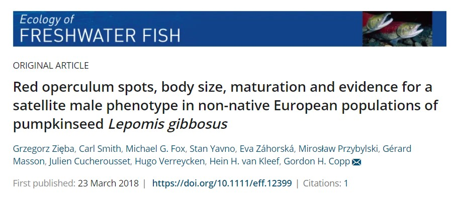
```

---
background-image: url(figs/pumpkinseed.jpg)
background-size: cover


<br>
<br>
Algunos individuos de los peces **_Lepomis gibbosus_** tienen un punto rojo sobre su opérculo, el que ha sido asociado con comportamientos de dominancia sobre estrategias de apareamiento. Estas estrategias relacionadas al sexo son:

- Ser **Macho Territorial** y <br>mantener un grupo de nidos.

- Ser **Macho Furtivo** y fecundar nidos <br>de peces territoriales.

- Algunas **hembras** tienen punto rojo, <br>se incluyen en la comparación.


---

.panelset[
.panel[.panel-name[Gráfico]
```{r, echo=F, out.width="78%", fig.align='center'}
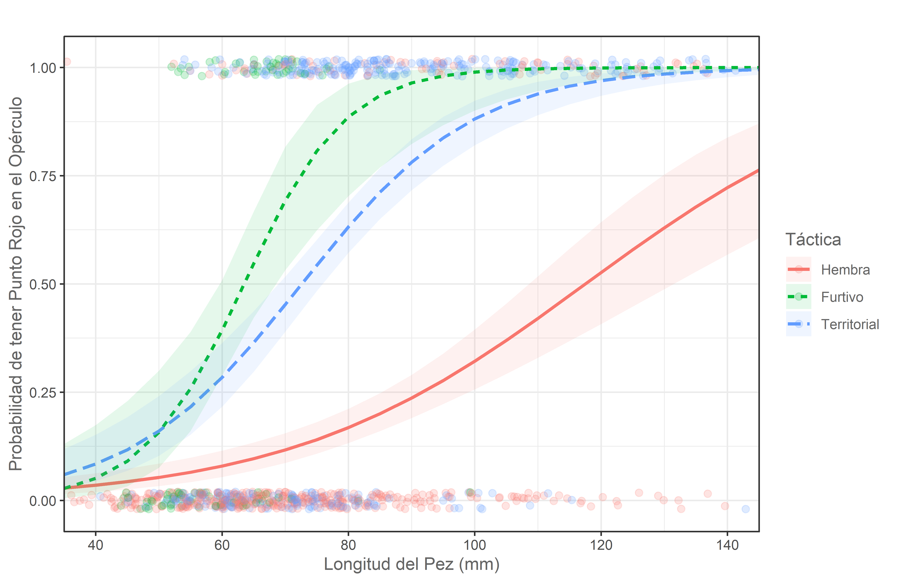
```
]

.panel[.panel-name[Código]

```{r, eval=F, layout='l-page'}
# Creación del modelo
final.bin <- glm(punto_rojo ~ tactica * longitud, data = pez, family = binomial(link = "logit"))

# Extracción de los datos del modelo
df <- ggeffects::ggpredict(final.bin, terms = c("longitud", "tactica"))

# Gráfico avanzado con ggplot2
ggplot(data=df, aes(x, predicted)) + 
  scale_x_continuous(breaks = seq(0,150,20), expand=c(0,0))+
  coord_cartesian(clip = "off")+
  geom_jitter(data=pez, aes(x=longitud, y=punto_rojo, color=tactica, group=tactica), 
              alpha=0.2, size=2,width = 0.05, height = 0.02)+
  geom_line(aes(linetype=group, color=group), lwd=1) +
  geom_ribbon(aes(ymin=conf.low, ymax=conf.high,fill=group), alpha=0.1) +
  labs(x="Longitud del Pez (mm)", y="Probabilidad de tener Punto Rojo en el Opérculo", title="",
       color="Táctica", linetype="Táctica", fill="Táctica")+
  theme_bw()+
  theme(text = element_text(colour = "#646464"))
```

.panel[.panel-name[Gráfico alternativo]

```{r, eval=F}
 p + facet_grid( ~ tactica, scales = "fixed", space = "free")
```

```{r, echo=F, out.width="90%", fig.align='center'}
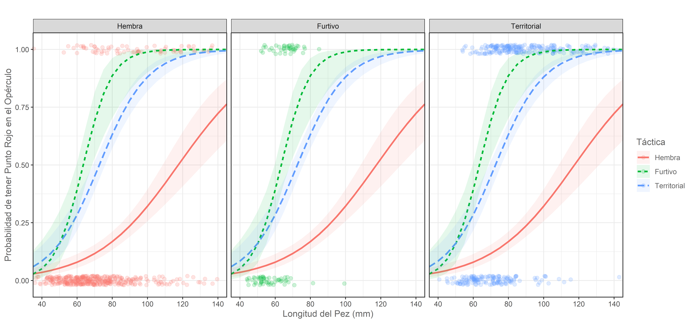
```
]

.panel[.panel-name[Código alternativo 2]
```{r, eval=F}
t <- ggplot(data=subset(df, df$group=="Territorial"), aes(x=x, y=predicted)) + 
  scale_x_continuous(breaks = seq(0,150,20), expand=c(0,0))+
  geom_jitter(data=subset(pez, pez$tactica=="Territorial"), aes(x=longitud, y=punto_rojo, group=tactica), 
color="#619CFF", alpha=0.2, size=2,width = 0.05, height = 0.02)+
  geom_line(color="#619CFF", lwd=1) +
  geom_ribbon(aes(ymin=conf.low, ymax=conf.high), fill="#619CFF", alpha=0.1) +
  labs(x="Longitud del Pez (mm)", y="Probabilidad de tener Punto Rojo en el Opérculo", 
       title="Territorial", color="Táctica")+ theme_bw() + theme(text = element_text(colour = "#646464"))
h <- ggplot(data=subset(df, df$group=="Hembra"), aes(x=x, y=predicted)) + 
  scale_x_continuous(breaks = seq(0,150,20), expand=c(0,0))+
  geom_jitter(data=subset(pez, pez$tactica=="Hembra"), aes(x=longitud, y=punto_rojo, group=tactica), 
color="#F8766D", alpha=0.2, size=2,width = 0.05, height = 0.02)+
  geom_line(color="#F8766D", lwd=1)+
  geom_ribbon(aes(ymin=conf.low, ymax=conf.high), fill="#F8766D", alpha=0.1) +
  labs(x="Longitud del Pez (mm)", y="Probabilidad de tener Punto Rojo en el Opérculo", 
       title="Hembra", color="Táctica")+ theme_bw() + theme(text = element_text(colour = "#646464"))
f <- ggplot(data=subset(df, df$group=="Furtivo"), aes(x=x, y=predicted)) + 
  scale_x_continuous(breaks = seq(0,150,20), expand=c(0,0))+
  geom_jitter(data=subset(pez, pez$tactica=="Furtivo"), aes(x=longitud, y=punto_rojo, group=tactica), 
color="#00BA38", alpha=0.2, size=2,width = 0.05, height = 0.02)+
  geom_line(color="#00BA38", lwd=1) +
  geom_ribbon(aes(ymin=conf.low, ymax=conf.high), fill="#00BA38", alpha=0.1) +
  labs(x="Longitud del Pez (mm)", y="Probabilidad de tener Punto Rojo en el Opérculo", 
       title="Furtivo", color="Táctica")+ theme_bw() + theme(text = element_text(colour = "#646464"))

ggpubr::ggarrange(h,f,t, ncol=3, nrow=1)

```
]

.panel[.panel-name[Gráfico alternativo 2]

```{r, echo=F, out.width="90%", fig.align='center'}
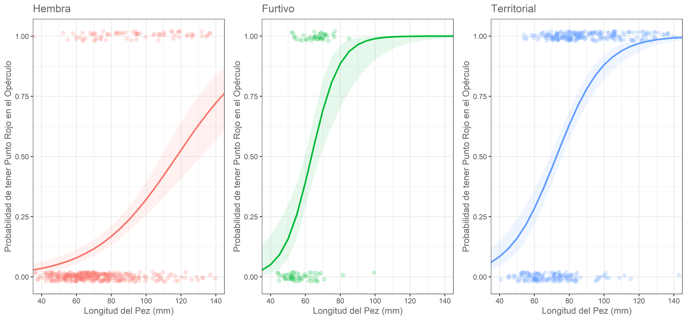
```
]

]
]

---

# Desarrollemos la práctica

```{r, echo=FALSE}
countdown::countdown(minutes = 60, seconds = 00, left = 0, right = 0, padding = "100px", margin = "12%", font_size = "6em", warn_when=30L)
```

---
background-image: url(figs/zorro.jpg)
background-size: cover

# Cuando Y no es Binaria

- Existen casos en los que la variable respuesta no es binaria (no se obtiene de un evento de Bernoulli): y obtenemos **Número de éxitos de un total de N intentos o eventos.**

--

- Estos son casos donde la distribución de probabilidades es Binomial y no Bernoulli puro.
 
--
 
.pull-left[ 

1. La fertilización cruzada de un Zorro de sechura **.purple[_Lycalopex sechurae_]** de Ecuador con uno de Perú produce algunas veces zorros totalmente grises. Se quiere encontrar la probabilidad de que nazcan zorros grises de un total de las cinco crías.

 $$Y = \text{# de zorros grises en cinco crías}$$
]

---
background-image: url(figs/zorro.jpg)
background-size: cover

# Problema de estudio

Deseamos conocer si los genes 208S2 y AD922 tienen relación con la probabilidad de encontrar un zorro gris en 10 crias.

```{r, eval=F}
# En estos casos, el modelo sería (T =  alumbramientos, N = crías)
glm(`(N/T)` ~ x1 + x2, data=DF, family = binomial(link = "logit"),`weights = T`)
```

.pull-left[
- Variable respuesta: $Y$ # de crías grises por cada 10 alumbramientos.

- Variables respuesta: genes 208S y AD92.
]

---

.panelset[
.panel[.panel-name[Gráfico]
```{r, echo=F, out.width="78%", fig.align='center'}
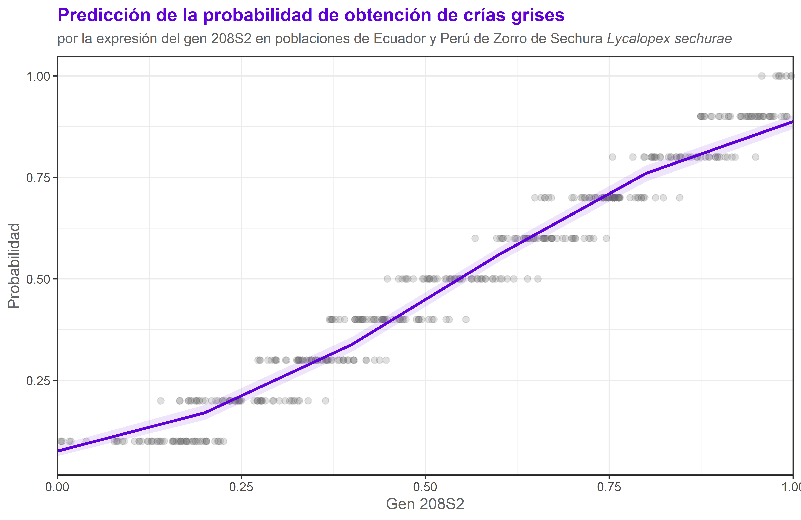
```
]


.panel[.panel-name[Código]

```{r, eval=F, layout='l-page'}
# Creación del modelo
modelo <- glm(cri_int ~ genAD922 + gen208S2, data=zorrito, 
              family=binomial(link = "logit"), weights = intentos)

# Extracción de los datos del modelo
df2 <- ggeffects::ggpredict(modelo, terms = c("gen208S2"))

# Gráfico avanzado con ggplot2
ggplot(data=df2, aes(x, predicted)) + 
  scale_x_continuous(expand=c(0,0))+
  coord_cartesian(clip = "off")+
  geom_point(data=zorrito, aes(x=gen208S2, y=cri_int), color="#646464", alpha=0.2, size=2)+
  geom_line(color="#5f00db", lwd=1) +
  geom_ribbon(aes(ymin=conf.low, ymax=conf.high), fill="#5f00db", alpha=0.1) +
  labs(y="Probabilidad", x="Gen 208S2",
       title="Predicción de la probabilidad de obtención de crías grises",
       subtitle = expression(paste("por la expresión del gen 208S2 en poblaciones de
                                   Ecuador y Perú de Zorro de Sechura", italic(" Lycalopex sechurae"))))+
  theme_bw()+
  theme(plot.title = element_text(colour = "#5f00db", face=2, size=13),
        plot.subtitle = element_text(size=10),
        text = element_text(colour = "#646464"))
```

]
]

---

# Desarrollemos la práctica

```{r, echo=FALSE}
countdown::countdown(minutes = 30, seconds = 00, left = 0, right = 0, padding = "100px", margin = "12%", font_size = "6em", warn_when=30L)
```

---
name: poisson
class: inverse, middle, center, hide-logo, animated, slideInRight

# Regresión de Poisson
[ Modelamiento de respuestas discretas tipo conteo ]

---
background-image: url(figs/ovejas.png)
background-size: cover

# Regresión de Poisson

--

- Es adecuado para datos ecológicos en los que la variable de respuesta comprende datos de **.orange[recuento]**:

--

 - número de individuos.

--

 - número de especies en un hábitat específico, etc.

--

- Los datos son **.orange[números enteros positivos]**. 


- Los ceros tienen mucha influencia. **.orange[Debe haber pocos ceros.]**

--

- Se asume que la **.orange[varianza es aproximadamente igual a la media]** (parámetro $\lambda$). 

---

# Caso de estudio Regresión de Poisson:

```{r, fig.align='center', out.width="70%", echo=FALSE, retina=4}

```

- [Base de Datos - Repo Figshare.com](https://figshare.com/articles/dataset/Data_of_survey_site_distribution_bird_species_richness_and_environment/9175574)
- [Artículo Original - Journal Ecology and Evolution](https://onlinelibrary.wiley.com/doi/full/10.1002/ece3.5286)
- Datos de **.orange[riqueza de especies de aves]** (todas las especies, residentes, migrantes de corta distancia y larga distancia tanto en bosques como en pastizales) y **datos ambientales** (temperatura media anual, profundidad de la nieve, elevación y extensión del hábitat circundante) en cada sitio en cada temporada

---

.panelset[
.panel[.panel-name[Gráfico 1]
```{r, echo=F, out.width="65%", fig.align='center'}
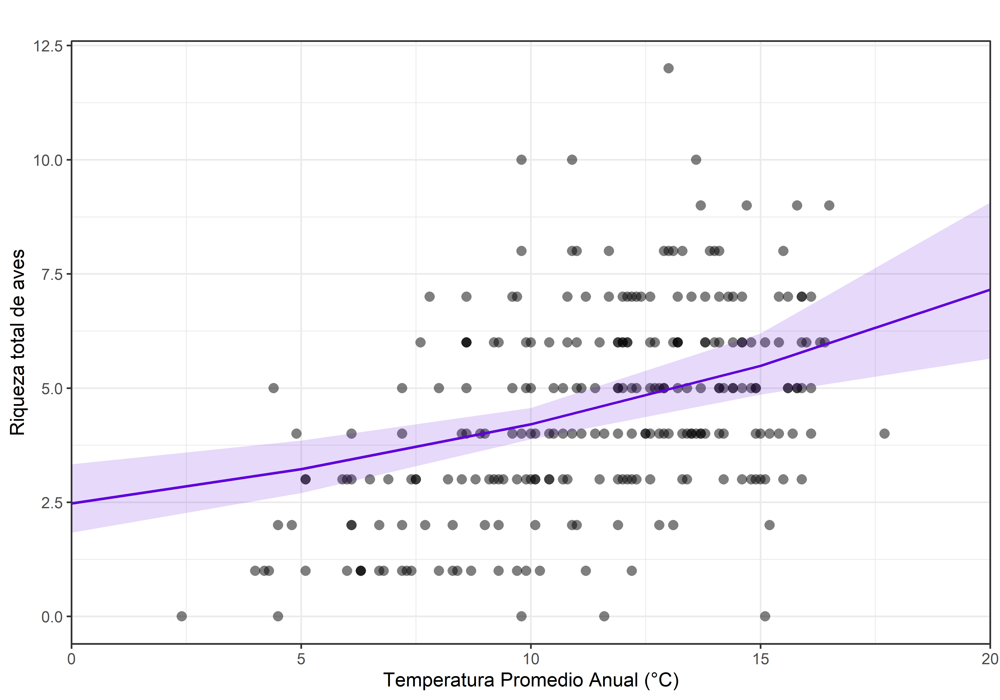
```
]

.panel[.panel-name[Código 1]

```{r, eval=F, layout='l-page'}
plot_model(glm.aves3, type="pred", show.data = T, 
           terms = c("temp_pa"), show.legend = F,
           colors = "#5f00db")+aes(color="", fill="")+ 
  theme_bw()+
    scale_x_continuous(expand=c(0,0))+
  coord_cartesian(clip="off")+
  labs(title="", y="Riqueza total de aves", 
       x="Temperatura Promedio Anual (°C)")
```

.panel[.panel-name[Gráfico 2]
```{r, echo=F, out.width="65%", fig.align='center'}
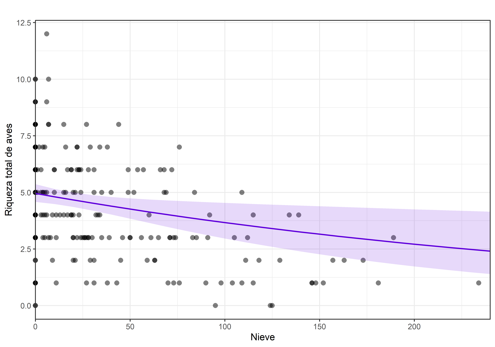
```
]

.panel[.panel-name[Código 2]
```{r, eval=F}
plot_model(glm.aves3, type="pred", show.data = T, 
           terms = c("nieve"), show.legend = F,
           colors = "#5f00db")+aes(color="", fill="")+ 
  theme_bw()+
    scale_x_continuous(expand=c(0,0))+
  coord_cartesian(clip="off")+
  labs(title="", y="Riqueza total de aves", x="Nieve")
```
]

.panel[.panel-name[Gráfico 3]
```{r, echo=F, out.width="65%", fig.align='center'}
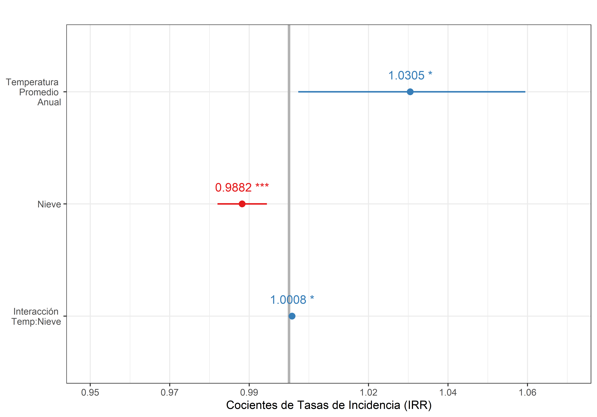
```
]

.panel[.panel-name[Código 3]
```{r, eval=F}
plot_model(glm.aves3, show.values = T, show.p = T, 
           vline.color = "gray70", digits = 4) + 
  theme_bw()+
  labs(title="", y="Cocientes de Tasas de Incidencia (IRR)")+
  scale_x_discrete(labels = c("temp_pa"="Temperatura \nPromedio \nAnual",
                              "nieve"="Nieve", 
                              "temp_pa:nieve"="Interacción \nTemp:Nieve"))+
  scale_y_continuous(limits = c(0.95,1.07), breaks = round(seq(0.95,1.08, length=7),2))

```
]

]
]

---

# Desarrollemos la práctica

```{r, echo=FALSE}
countdown::countdown(minutes = 60, seconds = 00, left = 0, right = 0, padding = "100px", margin = "12%", font_size = "6em", warn_when=30L)
```

---

# Intepretar los coeficientes (R. Poisson)

#### Para interpetar los resultados debemos exponenciar los coeficientes del modelo:

- $\mathrm{exp}(\beta_0):$ coeficiente del intercepto. Es el $\mathbb{E}[Y]$ (es decir el promedio $\mu$ esperado) cuando todas las $X_j$ = 0.

--

- $\mathrm{exp}(\beta_j):$ coeficiente de la variable $X_j$. Con cada unidad de incremento de la variable $X_j$, dicha variable tiene un efecto multiplicativo de $\mathrm{exp}(\beta_j)$ sobre el $\mathbb{E}[Y]$.  

--

#### Interpretar los resultados a primera vista nos puede dar una idea del efecto de $X_j$ sobre $\mathbb{E}[Y]$

- Si: $\beta_j=0 \to e^{\beta_j}=1 \to$ efecto nulo. El $\mathbb{E}[Y]$ es $\beta_0$. Además, $Y$ y $X_j$ no están relacionados.

--

- Si: $\beta_j>0 \to e^{\beta_j}>1 \to$ incremento del conteo en $\mathrm{exp}(\beta_j)$ veces.

--

- Si: $\beta_j<0 \to e^{\beta_j}<1 \to$ disminución del conteo en $\mathrm{exp}(\beta_j)$ veces.


---
class: inverse, middle, center, animated, slideInRight

# Regresión Binomial Negativa
[ GLM Poisson cuando se detecta sobredispersión ]

---

# Lidiando con sobredispersión en modelos de conteo

- Los modelos de poisson asumen que $\frac{\mu}{var} = 0$

- Cuando se detecta sobredispersión, se debe trabajar con modelos Binomiales Negativos.

```{r, eval=F}
glm_bn <- MASS::glm.nb(y ~ x1 + x2, data=DF, link = "log")
summary(glm_bn)
```

---
class: middle, center

# Gracias por su atención