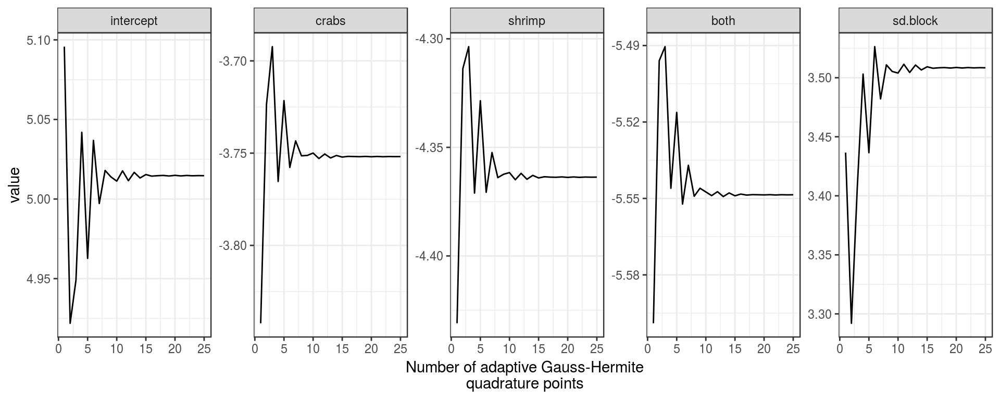

class: title-slide, middle, center

# <span style = 'font-size: 110%;color:#5f00db;'>Análisis Estadístico Lineal <br>Avanzado en R (parte II)</span>
## <span style = 'font-size: 75%;color:#212121;'>Curso Colaborativo IIAP - UNAMAD</span>
### <span style = 'font-size: 85%;color:#212121;'>Irwing S. Saldaña</span>
### <span style = 'font-size: 80%; color:#919191; font-weight:lighter;'>[Instituto de Ciencias Antonio Brack](https://www.brackinstitute.com/)<br>Departamento de Ecoinformática y Biogeografía<br>Perú, 2021</span>

```{r setup, include = FALSE}
library(knitr)
library(tidyverse)
# Opciones por defecto
options(htmltools.dir.version = FALSE)
opts_chunk$set(fig.width = 7.252, fig.height = 4, dpi = 600,
               fig.retina=4, warning = FALSE, message = FALSE, 
               cache=TRUE)
# Xaringan settings
xaringanExtra::use_tile_view() 
xaringanExtra::use_fit_screen() # xaringan-fit-screen
xaringanExtra::use_clipboard() #clipboard
xaringanExtra::use_editable(expires = 1) #Editable
xaringanExtra::use_scribble() #pencile with s
xaringanExtra::use_extra_styles(hover_code_line = TRUE, mute_unhighlighted_code = FALSE)

library(xaringanthemer)
style_mono_accent(base_color = "#5f00db",
                  title_slide_background_color="white",
                  code_highlight_color="#8ae8ff",
                  link_color="#52d3f2",
                  colors = c(
                    red = "#f34213", 
                    purple = "#3e2f5b",
                    orange = "#ff8811",
                    green = "#136f63",
                    white = "#FFFFFF"))
```

```{css, echo=FALSE}
/* Footnote */
.remark-slide-content:after {
    content: "Blgo. Irwing S. Saldaña | Instituto de Ciencias Antonio Brack, Perú";
    opacity: 0.9;
    position: absolute;
    text-align: left;
    height: 26px;
    font-size: 12pt;
    left: 120px;
    bottom: 18px;
    font-weight: normal;
    width: 1200px;
}

.scroll-box-8 {
  height:8em;
  overflow-y: scroll;
}
.scroll-box-10 {
  height:10em;
  overflow-y: scroll;
}
.scroll-box-12 {
  height:12em;
  overflow-y: scroll;
}
.scroll-box-14 {
  height:14em;
  overflow-y: scroll;
}
.scroll-box-16 {
  height:16em;
  overflow-y: scroll;
}
.scroll-box-18 {
  height:18em;
  overflow-y: scroll;
}
.scroll-box-19 {
  height:19em;
  overflow-y: scroll;
}
.scroll-box-22 {
  height:22em;
  overflow-y: scroll;
}
.scroll-output {
  height: 80%;
  overflow-y: scroll;
}
.pull-trescuartos{
    color: #777;
    width: 70%;
    height: 92%;
    float: left;
}
.pull-code {
    color: #777;
    width: 40%;
    height: 92%;
    float: left;
}
.pull-plot {
    width: 59%;
    float: right;
    padding-left: 1%;
}
.remark-inline-code {
    background: #e7e8e2;
    border-radius: 3px;
    padding: 4px;
}
.blockquote {
  border-left: solid 5px lightgray;
  padding-left: 1em;
}

```

---
class: inverse, middle, center 
background-image: url(figs/fondo.jpg)
background-size: cover
background-position: top

```{r, fig.align='center', out.width="25%", echo=FALSE}
include_graphics("figs/aboutme.png")
```

### Blgo. Irwing S. Saldaña <br><span style= 'font-size:80%; font-weigth: light;'> Instructor</span>
<span style= 'font-family: calibri; color: white'>Dpto. de Ecoinformática y Biogeografía,<br>
Instituto de Ciencias Antonio Brack, Perú</span>

.white[[Website](https://www.brackinstitute.com/)|[ ResearchGate ](https://www.researchgate.net/profile/Irwing-Saldana)|[ Linkedin ](https://www.linkedin.com/in/irssald/)|[ R Latam Blog ](https://rlatam.blog/)]|[ Github ](https://github.com/irwingss)

---
class: inverse, middle, center , animated, slideInRight
name: GLM

# Hurdle Models
[ Lidiando con exceso de ceros en conteos ]

--

<br>

<div class="box" style='padding:0.1em; background-color:#E9D8FD; color:#69337A'>
<span>
<p style='margin-top:1em; text-align:center'>
<b>RECORDEMOS</b></p>
<p style='margin-left:1em;'>
En los modelos de conteos (Poisson o Binomial Negativa), se asume que los ceros y los valores no ceros <br>(números enteros positivos) provienen de los mismos procesos de generación de datos.
<br>
<br>
</span>
</div>

---
background-image: url(figs/lcf.png)
background-size: cover

# Nociones de modelos para <br>lidar con Excesos de Ceros
.pull-trescuartos[
#### Model de Hurdle (Zero-altered models, ZAP/ZANB)
Los ceros son modelados con **Reg. Binomial**; los conteos con **Reg. de Poisson Zero-Truncada**. Todas las razones de que un conteo sea cero se modelan como probabilidad de ausencia.

> "Conteo >0" --- ¡Aquí estoy!  

> "Conteo = 0" --- No estoy:
>  - Porque el hábitat no es bueno.
>  - Porque no, aunque el hábitat es bueno.
>  - Porque no pudiste verme.
>  - Pensaste que era otra especie.

]

---
background-image: url(figs/lcf.png)
background-size: cover

.pull-trescuartos[
#### Model Zero-Inflados (Zero-altered models, ZAP/ZANB)
Un segundo modelo para lidiar con exceso de ceros son los ZAP/ZANB. El modelamiento es igual a modelos Hurdle, excepto que las razones de que un conteo sea cero se modelan como (1) probabilidad de ausencia y como (2) problemas de detectabilidad (dos procesos).

> ##### Procesos de conteo (P/BN)
> "Conteo >0" --- ¡Aquí estoy!  
> "Conteo = 0 como ausencia" --- No estoy:
>  - Porque el hábitat no es bueno.

> ##### Procesos de masa (B)
> "Conteo = 0 como prob. detect." --- No estoy:
>  - Porque no pudiste verme.
>  - Porque no, aunque el hábitat es bueno.
>  - Pensaste que era otra especie.
]

---

# Desarrollemos la práctica

```{r, echo=FALSE}
countdown::countdown(minutes = 30, seconds = 00, left = 0, right = 0, padding = "100px", margin = "12%", font_size = "6em", warn_when=30L)
```

---
class: inverse, middle, center , animated, slideInRight
name: GLM

# Modelos Generalizados <br>Lineales de Efectos Mixtos
[ GLMM ]

---
# GLMM

- Son modelos que involucran la **fusión de las dos grandes ventajas en modelamiento lineal** aprendidas en este curso: los efectos mixtos (proveniente de los LMM) y el relajar las asunciones teóricas de normalidad (proveniente de los GLM).

- Tienen la siguiente representación:

$$\left\{
\begin{array}{l}
Y_i \mid b_i \sim \mathcal F_\psi,\\\\
b_i \sim \mathcal N(0, D),
\end{array}
\right.$$
> Donde $Y_i$ es la respuesta de la iésima muestra, y $b_i$ es un vector de efectos aleatorios para esta unidad. La respuesta condicionada por los efectos aleatorios tiene distribución $\mathcal F$ parametrizada por el vector $\psi$. Se supone que los efectos aleatorios siguen una distribución normal multivariante con media 0 y matriz de varianza-covarianza $D$. 

---
# El problema de la integral cerrada

La **función de verosimilitud** de estos modelos tiene la siguiente forma general:

$$
L(\theta) = \prod_{i = 1}^n \int p(y_i \mid b_i; \psi) \, p(b_i; D) \, db_i,
$$

El problema es que la integral aquí no tiene una solución de forma cerrada. Por lo tanto, para estimar los parámetros en estos modelos con máxima verosimilitud, es necesario aproximar de alguna manera esta integral. Se conoce en la literatura dos soluciones:

- **Aproximación del integrando:** PQL y Aproximación de Laplace. Trabaja mejor con modelos:
    - Binomiales con gran N en el divisor (n/N). 
    - Poisson con grandes recuentos esperados.

- **Aproximación de la integral:** Monte Carlo y Cuadratura Adaptativa Gaussiana. Trabaja mejor con modelos:
    - Binomiales de bernulli ("Y" binaria).
    - Poisson con bajos recuentos esperados.

---

```{r, eval=FALSE}
# Permite Cuadratura GH con solo un efecto aleatorio. Para más efectos
# aleatorios se aplica automáticamente la Aproximación de Laplace

library(lme4)
glmer(..., nAGQ = 25)

```

```{r, fig.align='center', out.width="90%", echo=FALSE}

```

---

# Topología de modelos GLMM en R

#### Modelos de efectos mixtos GLMM usando `lme4::glmer`

```{r, eval=FALSE}
# Ejemplo GLMM
glmer(Var_respuesta ~ Efec_fijo + (1|Efec_Aleatorio), #<<
      data=DF, family="FAMILIA", nAGQ = 25) 
```

La interpretación de los modelos, sea cual sea el método que se aplique, sigue lo aprendido en el curso sobre interpretación de los efectos aleatorios, así como la correcta interpretación de los efectos fijos y su transformación necesaria como en los GLM previamente vistos.

---

# Desarrollemos la práctica

```{r, echo=FALSE}
countdown::countdown(minutes = 60, seconds = 00, left = 0, right = 0, padding = "100px", margin = "12%", font_size = "6em", warn_when=30L)
```

---

class: middle, center

# Gracias por su atención